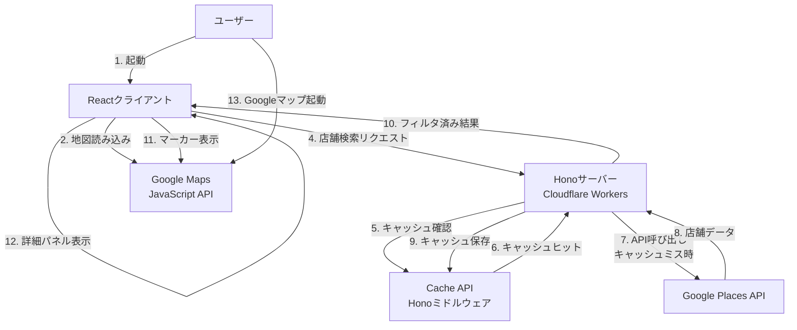
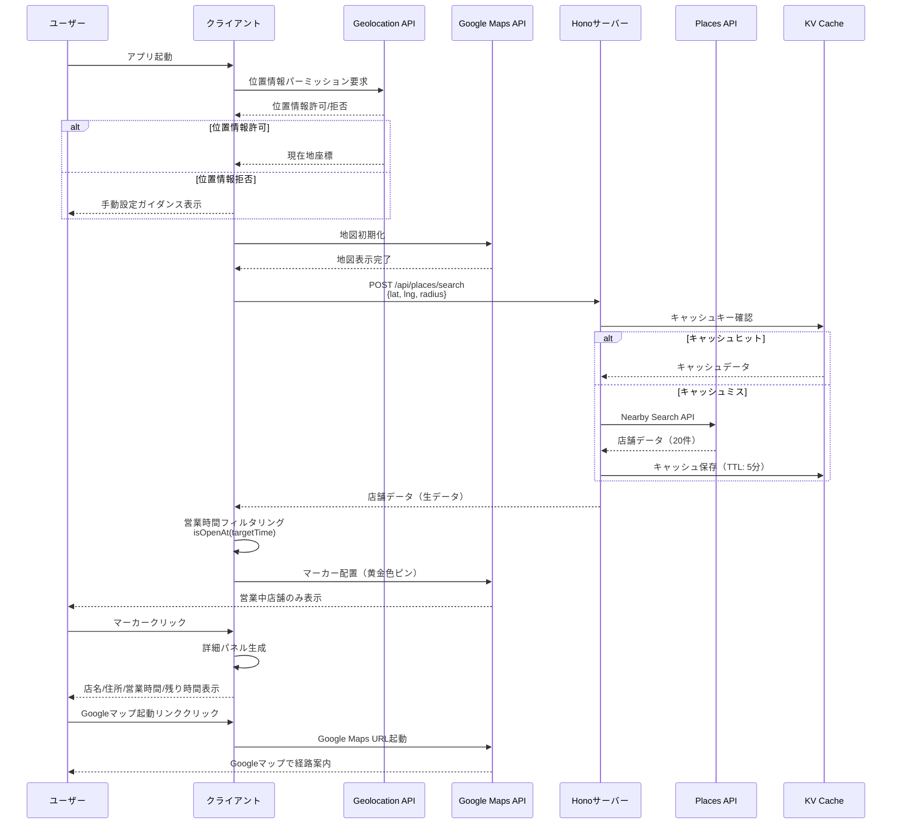
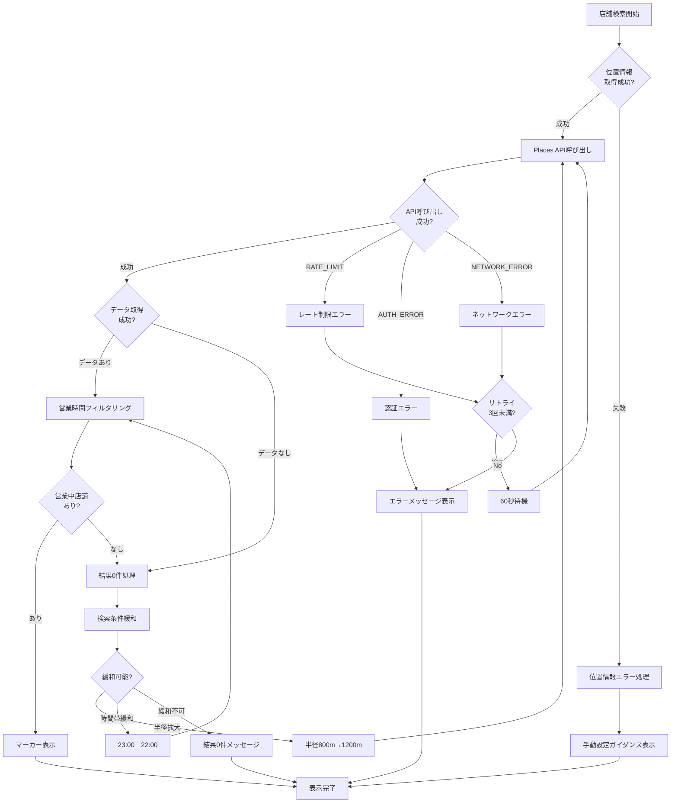
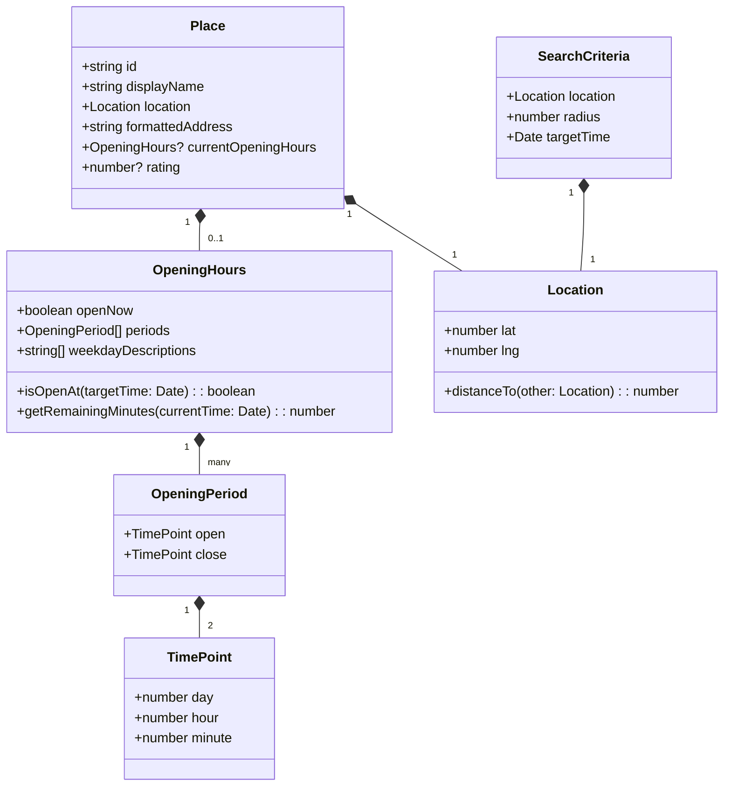

# 技術設計書

## 概要

よなよなディナーは、22時以降も営業中の飲食店だけを地図で表示するWebアプリケーションです。東京都および首都圏近郊の男性サラリーマン（20代後半〜40代前半）をターゲットに、残業後や終電後に「今開いている店」を素早く発見できる体験を提供します。

**ユーザー**: 主なターゲットは残業後・終電後に飲食店を探す男性サラリーマンで、疲れた状態でも2タップで店舗を発見し、Googleマップで経路案内を開始できるシンプルなワークフローを実現します。

**影響**: 既存のボイラープレートコード（Bun + Hono + Vite + React）を基盤とし、Google Maps APIとPlaces APIを統合した新規機能を追加します。

### 目標

- 起動から地図表示まで2秒以内の高速初回描画
- 営業時間フィルタリング（24時跨ぎ・複数スロット対応）の正確な実装
- モバイル最適化（片手操作・親指到達可能なUI配置）
- APIコスト最適化（キャッシング戦略による呼び出し削減）
- ダークテーマによる夜間視認性の向上

### 非目標（MVPスコープ外）

- 口コミ・評価の詳細表示機能
- 予約システムとの統合
- 会員登録・お気に入り機能
- 決済・クーポン機能
- アプリ内経路案内（Googleマップに委任）

## アーキテクチャ

### 既存アーキテクチャ分析

本プロジェクトは既存のモノレポボイラープレート上に構築されます：

- **モノレポ構成**: Bun workspaces + Turboによる依存関係管理
- **クライアント**: React 19.2.0 + Vite 6.4.0 + Tailwind CSS 4.1.14
- **サーバー**: Hono 4.10.1（Cloudflare Workers想定）
- **共通層**: workspace間で共有される型定義（`yonayona-dinner-shared`）
- **既存パターン**: shadcn/uiベースのコンポーネント設計、Biomeによるコード品質管理

### アーキテクチャ概要



### 技術スタック整合性

既存の技術スタックに以下の新規依存関係を追加します：

**フロントエンド追加依存関係(すべて最新版をインストールする)**:
- `@googlemaps/js-api-loader`: （Google Maps API読み込み）
- `@types/google.maps`:（TypeScript型定義）
- `date-fns`: （日時処理・営業時間判定）
- `date-fns-tz`: （タイムゾーン対応）

**バックエンド追加依存関係**:
- 新規依存なし（標準fetchとCloudflare Workers APIを使用）

**Hono Cache Middleware**:
- Web Standards Cache APIを使用（Honoビルトインミドルウェア）
- Cloudflare Workersで自動的にCache APIが利用可能

**技術選定の理由**:
- **Google Maps JavaScript API**: 要件で指定された地図表示・マーカー配置の標準的な選択肢
- **Google Places API (New)**: 営業時間情報を含む店舗検索の最新API
- **date-fns**: 軽量で関数型アプローチの日時ライブラリ、24時跨ぎ判定に最適
- **Hono Cache Middleware**: Web Standards Cache APIを使用、Cloudflare Workers環境でのキャッシング最適化

### レイヤー別実装パターン

本プロジェクトでは、サーバーサイドとクライアントサイドで異なる実装パターンを採用します。

#### サーバーサイド（`server/`）

**クラスベース実装が許可される範囲**（外部通信を行う場合のみ）:

```
server/
├── loaders/          # エントリーポイント（DI実施）
│   └── *.ts         # 具象Repositoryのインスタンス化を行う唯一の場所
├── usecases/         # ビジネスロジック（クラス）
│   └── *.ts         # 複数Repositoryの連携、エラーハンドリング
├── repositories/     # データアクセス層（クラス）
│   ├── interfaces/  # リポジトリインターフェース（type定義）
│   └── *.ts         # Google Places API等への外部API接続
└── utils/            # 純粋関数（関数ベース）
    └── *.ts         # 副作用なし、データ変換のみ
```

**実装パターン**:

```typescript
// server/src/repositories/interfaces/places-repository.interface.ts
export type IPlacesRepository = {
  searchNearby({
    location,
    radius
  }: {
    location: LatLng;
    radius: number;
  }): Promise<Result<Place[], PlacesAPIError>>;
};

// server/src/repositories/google-places.repository.ts
export class GooglePlacesRepository implements IPlacesRepository {
  constructor(private apiKey: string) {}

  async searchNearby({
    location,
    radius
  }: {
    location: LatLng;
    radius: number;
  }): Promise<Result<Place[], PlacesAPIError>> {
    // 実装
  }
}

// server/src/usecases/search-nearby-places.usecase.ts
export class SearchNearbyPlacesUsecase {
  constructor(
    private placesRepository: IPlacesRepository
  ) {}

  async execute(params: SearchParams): Promise<Result<...>> {
    // ビジネスロジック（キャッシングはHonoミドルウェアが自動処理）
  }
}

// server/src/loaders/search-places-loader.ts
export function createSearchPlacesLoader(env: Env) {
  return async (params: SearchParams) => {
    // DIの一元管理
    const placesRepo = new GooglePlacesRepository(env.GOOGLE_PLACES_API_KEY);
    const usecase = new SearchNearbyPlacesUsecase(placesRepo);
    return await usecase.execute(params);
  };
}
```

**判断基準**:
- **クラスベース**: 外部通信を行う（Places API、将来のDB接続等）
- **関数ベース**: 純粋関数のみ（utils、データ変換、計算処理等）

#### クライアントサイド（`client/`）

**完全に関数ベース実装**:

```
client/
├── components/       # Reactコンポーネント
│   └── *.tsx        # 関数コンポーネントのみ
├── services/         # API呼び出し（関数ベース）
│   └── *.ts         # 純粋関数として実装
├── hooks/            # カスタムフック
│   └── *.ts         # useXxx形式
└── lib/              # ユーティリティ（関数ベース）
    └── *.ts         # 副作用なし、純粋関数
```

**実装パターン**:

```typescript
// client/src/services/map-service.ts
export async function initializeMap({
  element,
  center
}: {
  element: HTMLElement;
  center: LatLng;
}): Promise<Result<google.maps.Map, MapError>> {
  // 実装
}

export function displayMarkers({
  map,
  places
}: {
  map: google.maps.Map;
  places: Place[];
}): Result<void, MarkerError> {
  // 実装
}

// client/src/services/places-service.ts
export async function searchNearby({
  location,
  radius
}: {
  location: LatLng;
  radius: number;
}): Promise<Result<Place[], PlacesAPIError>> {
  // サーバーへのfetch呼び出し
}

// client/src/lib/opening-hours-filter.ts
export function isOpenAt({
  openingHours,
  targetTime
}: {
  openingHours: OpeningHours | undefined;
  targetTime: Date;
}): boolean {
  // 純粋関数として営業時間判定
}

export function filterOpenPlaces({
  places,
  targetTime
}: {
  places: Place[];
  targetTime: Date;
}): Place[] {
  // 純粋関数としてフィルタリング
}
```

**理由**:
- クライアントサイドは外部APIへの直接通信なし（すべてサーバー経由）
- 状態管理はReact Hooksで十分
- DIパターンの必要性が低い（モック化が必要な外部依存なし）
- 関数型アプローチでシンプルに保つ

#### 共通層（`shared/`）

**型定義のみ（関数ベース）**:

```typescript
// shared/src/types/index.ts
export type Place = {
  id: string;
  displayName: string;
  location: LatLng;
  formattedAddress: string;
  currentOpeningHours?: OpeningHours;
};

export type Result<T, E> =
  | { success: true; data: T }
  | { success: false; error: E };
```

### 主要な技術的意思決定

#### 決定1: サーバーサイドプロキシパターンによるAPI統合

**決定**: Google Places APIへのすべてのリクエストをHonoサーバー経由で実行し、クライアントから直接APIを呼び出さない

**背景**: Google Places APIはAPIキー認証を必要とし、クライアントサイドに直接埋め込むとキーが露出するセキュリティリスクがある

**代替案**:
1. **クライアント直接呼び出し + HTTPリファラー制限**: シンプルだがAPIキーが露出し、リファラー偽装のリスクがある
2. **Firebase Extensionsの使用**: サーバーレス統合は容易だが、Cloudflare Workers環境との統合コストが高い
3. **サーバーサイドプロキシ（選択）**: Cloudflare Workers Secretsでキーを保護し、キャッシング層も統合可能

**選択したアプローチ**:

```typescript
// server/src/places-proxy.ts
export async function searchNearby({
  location,
  radius,
  env
}: {
  location: { lat: number; lng: number };
  radius: number;
  env: Env;
}): Promise<PlacesSearchResponse> {
  const apiKey = env.GOOGLE_PLACES_API_KEY; // Workers Secret

  const response = await fetch(
    'https://places.googleapis.com/v1/places:searchNearby',
    {
      method: 'POST',
      headers: {
        'Content-Type': 'application/json',
        'X-Goog-Api-Key': apiKey,
        'X-Goog-FieldMask': 'places.displayName,places.location,places.currentOpeningHours,places.formattedAddress'
      },
      body: JSON.stringify({
        includedTypes: ['restaurant', 'cafe', 'bar'],
        maxResultCount: 20,
        locationRestriction: {
          circle: { center: location, radius }
        }
      })
    }
  );

  return response.json();
}
```

**根拠**:
- **セキュリティ**: APIキーがクライアントに露出しない
- **コスト最適化**: サーバーサイドでField Maskを制御し、必要最小限のフィールドのみ取得
- **キャッシング**: Honoキャッシュミドルウェアでレスポンスをキャッシュし、API呼び出しを削減

**トレードオフ**:
- **利点**: セキュリティ強化、コスト最適化、キャッシング統合
- **欠点**: サーバーへの追加リクエストによるレイテンシ増加（~50ms）、Workers実行コスト

#### 決定2: クライアントサイド営業時間フィルタリング

**決定**: Places APIから取得した店舗データをサーバーで返却後、クライアント側で営業時間フィルタリングを実行

**背景**: Places API Nearby Searchには営業中フィルタがなく、すべての店舗を取得してからフィルタリングする必要がある

**代替案**:
1. **サーバーサイドフィルタリング**: サーバーで営業時間判定を実行し、フィルタ済みデータのみ返却
2. **クライアントサイドフィルタリング（選択）**: クライアントで営業時間判定とフィルタリングを実行
3. **Places API Text Searchの活用**: クエリで営業中を指定するが、精度が低く信頼性に欠ける

**選択したアプローチ**:

**根拠**:
- **リアルタイム性**: ユーザーが時間調整UIを操作した際に即座にフィルタリング結果を反映
- **サーバー負荷削減**: フィルタリング処理をクライアントに分散
- **キャッシュ効率**: 時間帯に依存しない生データをキャッシュし、再利用性を向上

**トレードオフ**:
- **利点**: 時間調整UIでの即座な反映、サーバー負荷削減、キャッシュ効率
- **欠点**: クライアントサイドでの追加処理、営業時間データの肥大化時のパフォーマンス懸念

#### 決定3: Google Maps JavaScript APIの直接統合

**決定**: クライアント側でGoogle Maps JavaScript APIを直接読み込み、地図表示とマーカー配置を実行

**背景**: 地図のインタラクティブな操作（ズーム、パン、マーカークリック）はクライアントサイドで実行する必要がある

**根拠**:
- **要件適合**: 地図表示とマーカー配置の要件を満たす標準的な選択肢
- **パフォーマンス**: Google CDNによる高速配信、グローバルキャッシング
- **統合容易性**: Places APIとの統合が容易で、型定義も充実

**トレードオフ**:
- **利点**: 標準的で信頼性が高い、Places APIとシームレス統合、豊富なドキュメント
- **欠点**: Google依存、APIキー管理の必要性、月間クレジット超過時の課金

#### 決定4: 依存性注入パターン（サーバーサイドのみ）

**決定**: サーバーサイドの外部通信層（Usecase、Repository）にクラスベースの依存性注入パターンを採用し、クライアントサイドは完全に関数ベースで実装

**背景**:
- Google Places APIへの外部依存がテストを困難にする
- モックリポジトリを注入することでユニットテストが可能になる
- Next.jsプロジェクトでの実績（参考: docs/server/2025-10-19_DI参考例.md）
- クライアントサイドは外部APIへの直接通信がなく、DIの必要性が低い
- キャッシングはHonoミドルウェアが自動処理するため、CacheRepositoryは不要

**アーキテクチャ**:

```
Loader（エントリーポイント）
  ↓ 具象Repositoryをインスタンス化
Usecase（ビジネスロジック）
  ↓ インターフェースに依存
IPlacesRepository（抽象）
  ↑ 実装
GooglePlacesRepository（具象）
```

**サーバーサイド実装例（クラスベース）**:

```typescript
// 1. インターフェース定義
type IPlacesRepository = {
  searchNearby({
    location,
    radius
  }: {
    location: LatLng;
    radius: number;
  }): Promise<Result<Place[], PlacesAPIError>>;
};

// 2. 具象クラス
class GooglePlacesRepository implements IPlacesRepository {
  constructor(private apiKey: string) {}

  async searchNearby({
    location,
    radius
  }: {
    location: LatLng;
    radius: number;
  }): Promise<Result<Place[], PlacesAPIError>> {
    // Google Places API呼び出し
    const response = await fetch(/* ... */);
    return { success: true, data: await response.json() };
  }
}

// 3. Usecase（ビジネスロジック）
class SearchNearbyPlacesUsecase {
  constructor(
    private placesRepository: IPlacesRepository
  ) {}

  async execute({
    location,
    radius,
    targetTime
  }: {
    location: LatLng;
    radius: number;
    targetTime: Date;
  }): Promise<Result<Place[], UsecaseError>> {
    // Places API呼び出し（キャッシングはHonoミドルウェアが自動処理）
    const result = await this.placesRepository.searchNearby({ location, radius });
    if (!result.success) return result;

    return result;
  }
}

// 4. Loader（DIの一元管理）
export function createSearchPlacesLoader(env: Env) {
  return async ({
    location,
    radius,
    targetTime
  }: {
    location: LatLng;
    radius: number;
    targetTime: Date;
  }) => {
    // 具象Repositoryのインスタンス化（Loaderのみが実施）
    const placesRepo = new GooglePlacesRepository(env.GOOGLE_PLACES_API_KEY);

    // Usecaseへの注入
    const usecase = new SearchNearbyPlacesUsecase(placesRepo);

    // 実行
    return await usecase.execute({ location, radius, targetTime });
  };
}

// 5. Honoルーター（キャッシュミドルウェア適用）
import { cache } from 'hono/cache';

app.post(
  '/api/places/search',
  cache({
    cacheName: 'yonayona-dinner-places',
    cacheControl: 'max-age=300', // 5分間キャッシュ
    keyGenerator: async (c) => {
      const body = await c.req.json();
      const lat = body.location.lat.toFixed(3);
      const lng = body.location.lng.toFixed(3);
      return `places:${lat}:${lng}:${body.radius}`;
    }
  }),
  async (c) => {
    const loader = createSearchPlacesLoader(c.env);
    const body = await c.req.json();
    const result = await loader(body);

    if (!result.success) {
      return c.json({ error: result.error }, 500);
    }
    return c.json(result.data);
  }
);
```

**クライアントサイド実装例（関数ベース）**:

```typescript
// client/src/services/map-service.ts
export async function initializeMap({
  element,
  center
}: {
  element: HTMLElement;
  center: LatLng;
}): Promise<Result<google.maps.Map, MapError>> {
  try {
    const { Map } = await google.maps.importLibrary("maps");
    const map = new Map(element, {
      center,
      zoom: 15,
      mapId: 'YONAYONA_DINNER_MAP'
    });
    return { success: true, data: map };
  } catch (error) {
    return {
      success: false,
      error: {
        type: 'INITIALIZATION_FAILED',
        message: error.message
      }
    };
  }
}

export function displayMarkers({
  map,
  places
}: {
  map: google.maps.Map;
  places: Place[];
}): Result<void, MarkerError> {
  try {
    places.forEach(place => {
      new google.maps.Marker({
        position: place.location,
        map,
        icon: {
          path: google.maps.SymbolPath.CIRCLE,
          fillColor: '#FFD700', // 黄金色
          fillOpacity: 1,
          strokeWeight: 2,
          strokeColor: '#FFFFFF',
          scale: 8
        }
      });
    });
    return { success: true, data: undefined };
  } catch (error) {
    return {
      success: false,
      error: {
        type: 'MARKER_CREATION_FAILED',
        message: error.message
      }
    };
  }
}

// client/src/services/places-service.ts
export async function searchNearby({
  location,
  radius
}: {
  location: LatLng;
  radius: number;
}): Promise<Result<Place[], PlacesAPIError>> {
  try {
    const response = await fetch('/api/places/search', {
      method: 'POST',
      headers: { 'Content-Type': 'application/json' },
      body: JSON.stringify({ location, radius })
    });

    if (!response.ok) {
      return {
        success: false,
        error: {
          type: 'NETWORK_ERROR',
          message: `HTTP ${response.status}`
        }
      };
    }

    const data = await response.json();
    return { success: true, data };
  } catch (error) {
    return {
      success: false,
      error: {
        type: 'NETWORK_ERROR',
        message: error.message
      }
    };
  }
}
```

**トレードオフ**:
- **利点**:
  - サーバーサイドのテスタビリティ向上（モックによるユニットテスト）
  - 疎結合なアーキテクチャ（外部APIの差し替え容易）
  - ビジネスロジックの再利用性（Loader、Action、API Routeから共通利用）
- **欠点**:
  - サーバーサイドのみクラスベース（学習コスト増加）
  - Loaderでのインスタンス化コード（ボイラープレート増加）
- **判断基準**:
  - 外部通信を行う場合のみDI適用（Places API）
  - それ以外は関数ベース（クライアントサイド全体、サーバーのutils等）

## システムフロー

### ユーザーフロー: 店舗検索と詳細表示



### エラーフローチャート: API失敗時の挙動



## 要件トレーサビリティ

| 要件ID | 要件概要 | コンポーネント | インターフェース | フロー参照 |
|--------|----------|--------------|--------------|----------|
| 1.1 | 位置情報パーミッション要求 | GeolocationService | `requestLocation()` | ユーザーフロー |
| 1.2 | 現在地中心の地図表示 | MapManager | `initializeMap()` | ユーザーフロー |
| 1.3 | 位置情報拒否時のガイダンス | ErrorHandler | `handleGeolocationError()` | エラーフロー |
| 1.4 | 起動から2秒以内の表示 | MapManager, PlacesService | - | パフォーマンス最適化 |
| 1.5 | ダークテーマ適用 | MapStyles | `DARK_THEME_STYLES` | - |
| 2.1 | 半径800m以内の店舗検索 | PlacesService | `searchNearby()` | ユーザーフロー |
| 2.2 | 営業時間情報の存在確認 | OpeningHoursFilter | `hasOpeningHours()` | ユーザーフロー |
| 2.3 | 営業中判定 | OpeningHoursFilter | `isOpenAt()` | ユーザーフロー |
| 2.4 | 営業時間情報なしの除外 | OpeningHoursFilter | `filterOpenPlaces()` | ユーザーフロー |
| 2.5 | 24時跨ぎ営業時間対応 | OpeningHoursFilter | `isOpenAt()` | ユーザーフロー |
| 2.6 | 複数営業時間スロット対応 | OpeningHoursFilter | `isOpenAt()` | ユーザーフロー |
| 3.1 | デフォルト23:00基準フィルタ | TimeFilterUI | `defaultFilterTime` | - |
| 3.2 | 15分刻み時間調整UI | TimeFilterUI | `onTimeChange()` | - |
| 3.3 | 時間帯変更時の再検索 | PlaceSearchController | `updateTimeFilter()` | - |
| 3.4 | プリセット時間帯表示 | TimeFilterUI | `PRESET_TIMES` | - |
| 4.1 | ピンタップで詳細パネル表示 | PlaceDetailPanel | `showDetail()` | ユーザーフロー |
| 4.2-4.5 | 店名/住所/営業時間表示 | PlaceDetailPanel | `renderDetail()` | ユーザーフロー |
| 4.6 | 閉店までの残り時間計算 | TimeCalculator | `calculateRemainingMinutes()` | ユーザーフロー |
| 5.1-5.3 | Googleマップ起動リンク | NavigationLink | `openGoogleMaps()` | ユーザーフロー |
| 6.1-6.3 | 検索結果0件時の緩和 | SearchRelaxation | `relaxSearchCriteria()` | エラーフロー |
| 7.1-7.3 | エラーハンドリング | ErrorHandler | `handleAPIError()` | エラーフロー |
| 8.1-8.4 | モバイル最適化 | ResponsiveUI | - | - |
| 9.1-9.4 | キャッシング | Honoキャッシュミドルウェア | `cache()` | ユーザーフロー |
| 10.1-10.3 | データプライバシー | GeolocationService | - | - |
| 11.1-11.4 | ブランドとUI | MapStyles, ThemeConfig | - | - |
| 12.1-12.5 | 計測とモニタリング | AnalyticsService | `trackEvent()` | - |

## コンポーネントとインターフェース

### フロントエンド層

#### MapManager

**責任と境界**
- **主要責任**: Google Maps APIの初期化、地図表示、マーカー管理、インタラクション処理
- **ドメイン境界**: UI/プレゼンテーション層（地図表示とユーザーインタラクション）
- **データ所有権**: 地図インスタンス、マーカーインスタンス、Info Windowインスタンス
- **トランザクション境界**: なし（UIのみ）

**依存関係**
- **Inbound**: PlaceSearchController（検索結果を受け取る）
- **Outbound**: Google Maps JavaScript API、PlaceDetailPanel（詳細表示）
- **External**: `@googlemaps/js-api-loader`、`@types/google.maps`

**外部依存関係調査**:
- **公式ドキュメント**: [Google Maps JavaScript API Overview](https://developers.google.com/maps/documentation/javascript/)
- **API署名**: `Loader.load()` はPromiseを返し、`google.maps`グローバルオブジェクトを初期化
- **認証方法**: APIキーによる認証（`apiKey`パラメータ）
- **レート制限**: QPS制限あり（デフォルト値は非公開、プロジェクトごとに設定）
- **バージョン管理**: `version: 'weekly'`で最新機能を取得、`version: 'quarterly'`で安定版を取得
- **既知の問題**: Advanced Markersは`mapId`が必須（Cloud Consoleで設定）
- **ベストプラクティス**: `importLibrary()`による動的インポートでバンドルサイズを削減

**契約定義**

**サービスインターフェース**:

```typescript
type MapService = {
  // 地図の初期化
  initializeMap({
    element,
    center
  }: {
    element: HTMLElement;
    center: LatLng;
  }): Promise<Result<google.maps.Map, MapError>>;

  // マーカーの配置
  displayMarkers({
    places
  }: {
    places: Place[];
  }): Result<void, MarkerError>;

  // マーカーのクリア
  clearMarkers(): void;

  // 地図の中心移動
  centerMap({ location }: { location: LatLng }): void;

  // ズームレベル設定
  setZoom({ level }: { level: number }): void;
}

type MapError =
  | { type: 'LOAD_FAILED'; message: string }
  | { type: 'API_KEY_INVALID'; message: string }
  | { type: 'INITIALIZATION_FAILED'; message: string };

type MarkerError =
  | { type: 'INVALID_LOCATION'; message: string }
  | { type: 'MARKER_CREATION_FAILED'; message: string };
```

**事前条件**:
- Google Maps APIキーが環境変数に設定されている
- 地図を表示するDOM要素が存在する
- 位置情報座標が有効な範囲内（緯度: -90~90、経度: -180~180）

**事後条件**:
- 地図が指定された要素に正常に描画される
- マーカーが地図上に配置される
- ユーザーのインタラクション（ズーム、パン、マーカークリック）が可能

**不変条件**:
- 地図インスタンスは1つのみ（シングルトンパターン）
- マーカーは営業中店舗のみ表示

#### PlacesService

**責任と境界**
- **主要責任**: Places API呼び出しの抽象化、サーバーとの通信、エラーハンドリング
- **ドメイン境界**: データアクセス層（外部API統合）
- **データ所有権**: API呼び出し結果のキャッシュ、リクエスト履歴
- **トランザクション境界**: なし（読み取り専用）

**依存関係**
- **Inbound**: PlaceSearchController（検索リクエスト）
- **Outbound**: Honoサーバー（`/api/places/search`エンドポイント）
- **External**: なし（標準fetch API使用）

**契約定義**

**サービスインターフェース**:

```typescript
type PlacesService = {
  // 近隣店舗検索
  searchNearby({
    location,
    radius
  }: {
    location: LatLng;
    radius: number;
  }): Promise<Result<Place[], PlacesAPIError>>;

  // 店舗詳細取得（将来拡張用）
  getPlaceDetails({
    placeId
  }: {
    placeId: string;
  }): Promise<Result<PlaceDetail, PlacesAPIError>>;
};

type PlacesAPIError =
  | { type: 'RATE_LIMIT'; retryAfter: number }
  | { type: 'AUTH_ERROR'; message: string }
  | { type: 'NETWORK_ERROR'; message: string }
  | { type: 'INVALID_REQUEST'; message: string }
  | { type: 'UNKNOWN_ERROR'; message: string };

type Place = {
  id: string;
  displayName: string;
  location: LatLng;
  formattedAddress: string;
  currentOpeningHours?: OpeningHours;
  rating?: number;
};

type OpeningHours = {
  openNow: boolean;
  periods: OpeningPeriod[];
  weekdayDescriptions: string[];
};

type OpeningPeriod = {
  open: { day: number; hour: number; minute: number };
  close: { day: number; hour: number; minute: number };
}
```

**事前条件**:
- サーバーが起動している
- 有効な位置情報座標が渡される
- 半径が正の数値

**事後条件**:
- 成功時: 店舗データの配列を返す（最大20件）
- 失敗時: エラータイプに応じた適切なエラーオブジェクトを返す

**不変条件**:
- リクエストは常にサーバー経由で実行される（クライアントから直接Places APIを呼び出さない）
- キャッシュは5分間有効

#### OpeningHoursFilter

**責任と境界**
- **主要責任**: 営業時間判定ロジック、24時跨ぎ対応、営業中店舗フィルタリング
- **ドメイン境界**: ビジネスロジック層（営業時間計算）
- **データ所有権**: なし（純粋関数として実装）
- **トランザクション境界**: なし

**依存関係**
- **Inbound**: PlaceSearchController（フィルタリング処理）
- **Outbound**: date-fns（日時計算）
- **External**: date-fns ^3.0.0

**外部依存関係調査**:
- **公式ドキュメント**: [date-fns Documentation](https://date-fns.org/)
- **API署名**: 関数型アプローチで、Dateオブジェクトを引数に取る
- **バージョン互換性**: v3.0.0以降で安定、v2からv3への移行ガイドあり
- **パフォーマンス**: Tree-shakingに対応、必要な関数のみインポート可能
- **既知の問題**: タイムゾーン処理にはdate-fns-tzが必要
- **ベストプラクティス**: `import { format, addHours } from 'date-fns'`で個別インポート

**契約定義**

**サービスインターフェース**:

```typescript
type OpeningHoursFilterService = {
  // 指定時刻に営業中かを判定
  isOpenAt({
    openingHours,
    targetTime
  }: {
    openingHours: OpeningHours | undefined;
    targetTime: Date;
  }): boolean;

  // 営業中店舗のみフィルタリング
  filterOpenPlaces({
    places,
    targetTime
  }: {
    places: Place[];
    targetTime: Date;
  }): Place[];

  // 閉店までの残り時間を計算（分単位）
  calculateRemainingMinutes({
    openingHours,
    currentTime
  }: {
    openingHours: OpeningHours;
    currentTime: Date;
  }): number | null;

  // 営業時間情報の存在確認
  hasOpeningHours({ place }: { place: Place }): boolean;
}
```

**事前条件**:
- `targetTime`は有効なDateオブジェクト
- `openingHours.periods`は空でない配列（営業時間が存在する場合）

**事後条件**:
- `isOpenAt()`: 営業中の場合`true`、閉店中または営業時間情報なしの場合`false`を返す
- `filterOpenPlaces()`: 営業中店舗のみを含む配列を返す（元の配列は変更しない）
- `calculateRemainingMinutes()`: 閉店までの分数を返す、営業時間外の場合`null`を返す

**不変条件**:
- すべての関数は純粋関数（副作用なし）
- 元のデータを変更しない（イミュータブル）

#### GeolocationService

**責任と境界**
- **主要責任**: 位置情報の取得、パーミッション管理、エラーハンドリング
- **ドメイン境界**: インフラストラクチャ層（ブラウザAPI統合）
- **データ所有権**: 現在地座標、パーミッション状態
- **トランザクション境界**: なし

**依存関係**
- **Inbound**: PlaceSearchController（位置情報要求）
- **Outbound**: Geolocation API（ブラウザ標準）
- **External**: なし（ブラウザ標準API）

**契約定義**

**サービスインターフェース**:

```typescript
type GeolocationService = {
  // 現在地取得
  getCurrentLocation(): Promise<Result<LatLng, GeolocationError>>;

  // パーミッション確認
  checkPermission(): Promise<PermissionState>;
};

type GeolocationError =
  | { type: 'PERMISSION_DENIED'; message: string }
  | { type: 'POSITION_UNAVAILABLE'; message: string }
  | { type: 'TIMEOUT'; message: string }
  | { type: 'NOT_SUPPORTED'; message: string };

type PermissionState = 'granted' | 'denied' | 'prompt';
```

**事前条件**:
- ブラウザがGeolocation APIをサポートしている
- HTTPS接続または localhost環境（Geolocation APIの要件）

**事後条件**:
- 成功時: 緯度・経度を含む座標オブジェクトを返す
- 失敗時: エラータイプに応じた適切なエラーオブジェクトを返す

**不変条件**:
- 位置情報は端末内でのみ使用し、サーバーに送信しない（プライバシー要件）

#### TimeFilterUI

**責任と境界**
- **主要責任**: 時間帯調整UIの表示、ユーザー入力の処理、プリセット時間帯の提供
- **ドメイン境界**: UI/プレゼンテーション層
- **データ所有権**: 選択された時間帯、プリセット時間帯リスト
- **トランザクション境界**: なし

**依存関係**
- **Inbound**: PlaceSearchController（時間帯変更通知）
- **Outbound**: なし
- **External**: React 19.2.0、shadcn/ui（Slider、Select）

**契約定義**

**Reactコンポーネントインターフェース**:

```typescript
type TimeFilterUIProps = {
  // 現在選択されている時間帯
  selectedTime: Date;

  // 時間帯変更時のコールバック
  onTimeChange: ({ newTime }: { newTime: Date }) => void;

  // プリセット時間帯
  presetTimes?: Date[];
}

const PRESET_TIMES = [
  { label: '22:00', hour: 22 },
  { label: '23:00', hour: 23 },
  { label: '24:00', hour: 24 },
  { label: '01:00', hour: 1 }
];
```

**状態管理**:

```typescript
type TimeFilterState = {
  selectedTime: Date;
  isCustomTime: boolean;
};
```

**事前条件**:
- `selectedTime`は有効なDateオブジェクト
- `onTimeChange`は関数

**事後条件**:
- 時間帯変更時に`onTimeChange`コールバックが呼び出される
- UIは選択された時間帯を反映

### バックエンド層

#### PlacesProxyHandler

**責任と境界**
- **主要責任**: Places APIへのプロキシリクエスト、APIキー管理、レスポンスの整形
- **ドメイン境界**: インフラストラクチャ層（外部API統合）
- **データ所有権**: なし（プロキシのみ）
- **トランザクション境界**: なし（読み取り専用）

**依存関係**
- **Inbound**: Honoルーター（`/api/places/search`エンドポイント）
- **Outbound**: Google Places API（Honoキャッシュミドルウェアが自動的にキャッシング）
- **External**: Google Places API (New)

**外部依存関係調査**:
- **公式ドキュメント**: [Places API (New) - Nearby Search](https://developers.google.com/maps/documentation/places/web-service/nearby-search)
- **エンドポイント**: `https://places.googleapis.com/v1/places:searchNearby`
- **認証方法**: `X-Goog-Api-Key`ヘッダーによるAPIキー認証
- **レート制限**: プロジェクトごとにQPS制限あり（Cloud Consoleで確認）
- **Field Mask**: `X-Goog-FieldMask`ヘッダーで取得フィールドを指定（課金最適化）
- **リクエスト形式**: JSON形式のPOSTリクエスト
- **既知の問題**: `openNow`フィルタは廃止、`currentOpeningHours`で営業時間を取得してフィルタリング
- **ベストプラクティス**: 必要最小限のフィールドのみ取得、キャッシングで呼び出し削減

**契約定義**

**API契約**:

| Method | Endpoint | Request | Response | Errors |
|--------|----------|---------|----------|--------|
| POST | /api/places/search | SearchNearbyRequest | PlacesSearchResponse | 400, 429, 500, 503 |

**リクエストスキーマ**:

```typescript
type SearchNearbyRequest = {
  location: {
    lat: number;  // -90~90
    lng: number;  // -180~180
  };
  radius: number; // メートル単位、1~50000
};
```

**レスポンススキーマ**:

```typescript
type PlacesSearchResponse = {
  places: Place[];
};

type Place = {
  id: string;
  displayName: string;
  location: { lat: number; lng: number };
  formattedAddress: string;
  currentOpeningHours?: OpeningHours;
  rating?: number;
}
```

**エラーレスポンス**:

| Status | Error Type | Description |
|--------|-----------|-------------|
| 400 | INVALID_REQUEST | リクエストパラメータが無効 |
| 429 | RATE_LIMIT | レート制限超過 |
| 500 | INTERNAL_ERROR | サーバー内部エラー |
| 503 | SERVICE_UNAVAILABLE | Places APIが利用不可 |

**事前条件**:
- リクエストボディが有効なJSON
- 位置情報座標が有効範囲内
- 半径が1~50000メートル

**事後条件**:
- 成功時: 店舗データの配列を返す（最大20件）
- 失敗時: エラーステータスとエラーメッセージを返す

#### Honoキャッシュミドルウェア

**責任と境界**
- **主要責任**: APIレスポンスの自動キャッシング、Cache-Control管理、キャッシュキー生成
- **ドメイン境界**: インフラストラクチャ層（HTTPキャッシング）
- **データ所有権**: HTTPレスポンスのキャッシュ
- **トランザクション境界**: なし

**依存関係**
- **Inbound**: Honoルーター（すべてのAPIエンドポイント）
- **Outbound**: Web Standards Cache API
- **External**: Cloudflare Workers Cache API

**外部依存関係調査**:
- **公式ドキュメント**: [Hono Cache Middleware](https://hono.dev/docs/middleware/builtin/cache)
- **Cache API**: [Web Standards Cache API](https://developer.mozilla.org/en-US/docs/Web/API/Cache)
- **Cloudflare実装**: [Cache on Cloudflare Docs](https://developers.cloudflare.com/workers/runtime-apis/cache/)
- **TTL設定**: `Cache-Control`ヘッダーで`max-age`を指定
- **既知の問題**: Cloudflare Workersではカスタムドメイン必須
- **ベストプラクティス**: `cacheControl`オプションで適切なTTLを設定

**実装パターン**

**Honoルーター統合**:

```typescript
import { Hono } from 'hono';
import { cache } from 'hono/cache';

const app = new Hono();

// Places API検索エンドポイントにキャッシュミドルウェアを適用
app.post(
  '/api/places/search',
  cache({
    cacheName: 'yonayona-dinner-places',
    cacheControl: 'max-age=300', // 5分間キャッシュ
    keyGenerator: (c) => {
      // リクエストボディから位置情報と半径を取得してキャッシュキーを生成
      const body = await c.req.json();
      return `places:${body.location.lat}:${body.location.lng}:${body.radius}`;
    }
  }),
  async (c) => {
    // Places API呼び出し処理
    const body = await c.req.json();
    const result = await searchNearbyPlaces(body.location, body.radius, c.env);
    return c.json(result);
  }
);
```

**キャッシュキー生成戦略**:

```typescript
// 位置情報と半径に基づくキャッシュキー生成
function generateCacheKey({
  location,
  radius
}: {
  location: { lat: number; lng: number };
  radius: number;
}): string {
  // 座標を小数点3桁に丸める（約110mの精度）
  const lat = location.lat.toFixed(3);
  const lng = location.lng.toFixed(3);
  return `places:${lat}:${lng}:${radius}`;
}
```

**事前条件**:
- Cloudflare Workersでカスタムドメインが設定されている
- リクエストボディが有効なJSON

**事後条件**:
- キャッシュヒット時: Cache APIから直接レスポンスを返す（Places API呼び出しなし）
- キャッシュミス時: Places APIを呼び出し、レスポンスをキャッシュに保存

**不変条件**:
- キャッシュキーは一意（位置情報と半径から生成）
- TTLは5分（300秒）固定（`max-age=300`）
- ステータスコード200のみキャッシュ（デフォルト動作）

## データモデル

### ドメインモデル

本システムは複雑なドメインロジックを持たないため、簡潔なデータモデルを採用します。

**コアコンセプト**:

- **Place（店舗）**: 値オブジェクト、営業時間情報を含む飲食店の基本情報
- **OpeningHours（営業時間）**: 値オブジェクト、営業時間帯のリストと営業中フラグ
- **Location（位置情報）**: 値オブジェクト、緯度・経度の座標
- **SearchCriteria（検索条件）**: 値オブジェクト、位置情報・半径・時間帯を含む検索パラメータ

**ドメインイベント**:

- `LocationObtained`: 位置情報が取得された
- `PlacesSearched`: 店舗検索が実行された
- `TimeFilterChanged`: 時間帯フィルタが変更された
- `PlaceSelected`: 店舗が選択された



**ビジネスルールと不変条件**:

1. **営業時間の整合性**: `periods`配列は空でない、各`period`は`open`と`close`を持つ
2. **座標の有効性**: 緯度は-90~90、経度は-180~180の範囲内
3. **半径の妥当性**: 半径は1~50000メートルの範囲内
4. **営業中判定**: `currentOpeningHours.periods`を基に、24時跨ぎを考慮した判定を実行

### 論理データモデル

**エンティティ関係**:

- **Place** (1) - (0..1) **OpeningHours**: 店舗は営業時間情報を持つ（任意）
- **OpeningHours** (1) - (many) **OpeningPeriod**: 営業時間は複数の営業時間帯を持つ
- **Place** (1) - (1) **Location**: 店舗は1つの位置情報を持つ

**属性と型定義**:

```typescript
// Place Entity
type Place = {
  id: string;                    // 一意識別子（Google Place ID）
  displayName: string;           // 表示名
  location: Location;            // 位置情報
  formattedAddress: string;      // 住所
  currentOpeningHours?: OpeningHours; // 営業時間（任意）
  rating?: number;               // 評価（0.0-5.0、任意）
};

// OpeningHours Value Object
type OpeningHours = {
  openNow: boolean;              // 現在営業中フラグ
  periods: OpeningPeriod[];      // 営業時間帯リスト
  weekdayDescriptions: string[]; // 曜日別営業時間説明
};

// OpeningPeriod Value Object
type OpeningPeriod = {
  open: TimePoint;               // 開店時刻
  close: TimePoint;              // 閉店時刻
};

// TimePoint Value Object
type TimePoint = {
  day: number;                   // 曜日（0=日曜, 6=土曜）
  hour: number;                  // 時（0-23）
  minute: number;                // 分（0-59）
};

// Location Value Object
type Location = {
  lat: number;                   // 緯度（-90~90）
  lng: number;                   // 経度（-180~180）
}
```

**整合性と整合性制約**:

- **参照整合性**: `Place.currentOpeningHours`は`OpeningHours`への参照（任意）
- **カーディナリティ**: `OpeningHours.periods`は1つ以上の`OpeningPeriod`を持つ
- **時間的側面**: 営業時間データはAPIから取得時点のスナップショット、5分間キャッシュされる

### データ契約とインテグレーション

#### API データ転送

**リクエストスキーマ**:

```typescript
// クライアント → サーバー
type SearchNearbyRequest = {
  location: {
    lat: number;
    lng: number;
  };
  radius: number;
};
```

**レスポンススキーマ**:

```typescript
// サーバー → クライアント
type PlacesSearchResponse = {
  places: Place[];
};
```

**バリデーションルール**:

```typescript
// リクエストバリデーション（サーバー側）
function validateSearchRequest({
  req
}: {
  req: SearchNearbyRequest;
}): Result<SearchNearbyRequest, ValidationError> {
  if (req.location.lat < -90 || req.location.lat > 90) {
    return { success: false, error: 'INVALID_LATITUDE' };
  }
  if (req.location.lng < -180 || req.location.lng > 180) {
    return { success: false, error: 'INVALID_LONGITUDE' };
  }
  if (req.radius < 1 || req.radius > 50000) {
    return { success: false, error: 'INVALID_RADIUS' };
  }
  return { success: true, data: req };
}
```

**シリアライゼーション形式**: JSON

#### クロスサービスデータ管理

**キャッシュ戦略**:

- **キャッシュキー**: `places:${lat}:${lng}:${radius}` 形式
- **TTL**: 5分（300秒）
- **無効化**: TTL経過後に自動削除、手動無効化なし

**結果整合性の処理**:

- Web Standards Cache APIは強整合性（Cache-Controlヘッダーに基づく明確なTTL管理）
- キャッシュが古い場合、最大5分間のズレが生じる可能性がある（TTL範囲内）
- ユーザーは時間調整UIで手動リフレッシュ可能（再検索により新しいデータを取得）

## エラーハンドリング

### Result型パターン

本プロジェクトでは、TypeScriptの標準機能のみを使用したシンプルなResult型を採用します。

#### Result型定義

```typescript
type Result<T, E> =
  | { success: true; data: T }
  | { success: false; error: E };
```

#### 自作する理由

- **軽量性**: 外部依存なし、必要最小限の型定義のみ
- **プロジェクト固有の要件**: 詳細なエラー型定義（MapError, PlacesAPIError等）に対応
- **学習コスト削減**: シンプルな構造でチーム全体が理解しやすい
- **TypeScript標準機能のみ**: ビルドサイズへの影響なし、追加ライブラリ不要

#### 既存ライブラリを採用しない理由

**検討したライブラリ**: neverthrow, ts-results, oxide.ts

**不採用の理由**:
- **過度な機能**: `map()`, `andThen()`, `unwrap()`等の関数型メソッドは本プロジェクトでは不要
- **依存関係の増加**: MVP段階では外部依存を最小化したい
- **チームの習熟度**: 関数型プログラミングの知識を前提としない設計
- **バンドルサイズ**: クライアントバンドルに含まれる場合のサイズ増加を避ける
- **TypeScriptネイティブで十分**: Discriminated Unionsで型安全性は確保可能

**トレードオフ**:
- **利点**: シンプル、軽量、学習コスト低、依存関係なし
- **欠点**: 関数型メソッド（map, flatMap等）は自前実装が必要（本プロジェクトでは不要と判断）

#### 使用例

```typescript
// 関数定義
function displayMarkers({
  map,
  places
}: {
  map: google.maps.Map;
  places: Place[];
}): Result<void, MarkerError> {
  try {
    places.forEach(place => {
      new google.maps.Marker({
        position: place.location,
        map
      });
    });
    return { success: true, data: undefined };
  } catch (error) {
    return {
      success: false,
      error: {
        type: 'MARKER_CREATION_FAILED',
        message: error.message
      }
    };
  }
}

// 呼び出し側
const result = displayMarkers({ map, places });
if (result.success) {
  console.log('マーカー配置成功');
} else {
  // TypeScriptがresult.errorの型を推論
  handleMarkerError(result.error);
}
```

### エラー戦略

本システムでは、エラーを以下の3つのカテゴリに分類し、それぞれに適切な処理と回復メカニズムを適用します。

**エラーカテゴリと対応戦略**:

1. **ユーザーエラー（4xx相当）**: バリデーション、ガイダンス表示、手動修正を促す
2. **システムエラー（5xx相当）**: リトライ、フォールバック、エラーメッセージ表示
3. **ビジネスロジックエラー（422相当）**: 検索条件の自動緩和、代替案の提示

### エラーカテゴリと対応

#### ユーザーエラー（4xx）

**位置情報パーミッション拒否**:

```typescript
// エラーハンドリング
if (error.type === 'PERMISSION_DENIED') {
  showErrorMessage({
    title: '位置情報が必要です',
    message: '現在地周辺の店舗を検索するには、位置情報パーミッションを許可してください。',
    actions: [
      { label: '設定を開く', onClick: () => openSettings() },
      { label: '手動で場所を設定', onClick: () => showManualLocationPicker() }
    ]
  });
}
```

**無効な検索パラメータ**:

```typescript
// バリデーションエラー
if (radius < 1 || radius > 50000) {
  showFieldError({
    field: 'radius',
    message: '検索範囲は1〜50000メートルの範囲で指定してください。'
  });
}
```

#### システムエラー（5xx）

**Places API呼び出し失敗**:

```typescript
// リトライロジック
async function searchWithRetry(
  request: SearchNearbyRequest,
  maxRetries = 3
): Promise<Result<Place[], PlacesAPIError>> {
  for (let attempt = 1; attempt <= maxRetries; attempt++) {
    const result = await placesService.searchNearby(
      request.location,
      request.radius
    );

    if (result.success) {
      return result;
    }

    // レート制限エラーの場合、指定時間待機
    if (result.error.type === 'RATE_LIMIT') {
      if (attempt < maxRetries) {
        await delay(result.error.retryAfter);
        continue;
      }
    }

    // ネットワークエラーの場合、指数バックオフ
    if (result.error.type === 'NETWORK_ERROR') {
      if (attempt < maxRetries) {
        await delay(1000 * Math.pow(2, attempt - 1));
        continue;
      }
    }

    // その他のエラーは即座に返す
    return result;
  }
}
```

**Google Maps API読み込み失敗**:

```typescript
// フォールバックUI
try {
  await mapManager.initializeMap(mapElement, center);
} catch (error) {
  showFallbackUI({
    message: '地図の読み込みに失敗しました。',
    actions: [
      { label: '再読み込み', onClick: () => location.reload() }
    ]
  });
}
```

**位置情報取得タイムアウト**:

```typescript
// タイムアウトエラー処理
const GEOLOCATION_TIMEOUT = 10000; // 10秒

try {
  const location = await geolocationService.getCurrentLocation({
    timeout: GEOLOCATION_TIMEOUT
  });
} catch (error) {
  if (error.type === 'TIMEOUT') {
    showErrorMessage({
      title: '位置情報の取得に時間がかかっています',
      message: '手動で場所を設定するか、しばらく待ってから再試行してください。',
      actions: [
        { label: '手動設定', onClick: () => showManualLocationPicker() },
        { label: '再試行', onClick: () => retryGetLocation() }
      ]
    });
  }
}
```

#### ビジネスロジックエラー（422）

**検索結果0件時の自動緩和**:

```typescript
// 検索条件の段階的緩和
async function searchWithRelaxation(
  initialCriteria: SearchCriteria
): Promise<Place[]> {
  let criteria = initialCriteria;

  // Step 1: 初回検索
  let places = await searchAndFilter(criteria);

  if (places.length === 0) {
    // Step 2: 半径を拡大（800m → 1200m）
    criteria.radius = 1200;
    places = await searchAndFilter(criteria);

    if (places.length === 0) {
      // Step 3: 時間帯を緩和（23:00 → 22:00）
      criteria.targetTime = subHours(criteria.targetTime, 1);
      places = await searchAndFilter(criteria);

      if (places.length === 0) {
        // Step 4: 半径をさらに拡大（1200m → 2000m）
        criteria.radius = 2000;
        places = await searchAndFilter(criteria);

        if (places.length === 0) {
          // すべての緩和策を実行しても結果0件
          showNoResultsMessage({
            message: '周辺に営業中の店舗が見つかりませんでした。',
            suggestion: '時間帯や場所を変更して再度検索してください。'
          });
        }
      }
    }
  }

  return places;
}
```

**営業時間情報不明店舗の扱い**:

```typescript
// 営業時間情報がない店舗を除外
const placesWithHours = places.filter(place =>
  place.currentOpeningHours && place.currentOpeningHours.periods.length > 0
);

// 除外された店舗数を通知
if (placesWithHours.length < places.length) {
  const excludedCount = places.length - placesWithHours.length;
  showInfoBadge({
    message: `営業時間情報がない店舗${excludedCount}件を除外しました。`
  });
}
```

### モニタリング

**エラートラッキング**:

```typescript
// エラー計測
function trackError(error: AppError) {
  analytics.trackEvent('error', {
    type: error.type,
    message: error.message,
    stack: error.stack,
    timestamp: new Date().toISOString()
  });
}

// エラー発生時に自動トラッキング
try {
  // 処理
} catch (error) {
  trackError(error);
  throw error;
}
```

**ロギング**:

```typescript
// サーバーサイドロギング（Cloudflare Workers）
export default {
  async fetch(request: Request, env: Env, ctx: ExecutionContext) {
    try {
      const response = await handleRequest(request, env);

      // 成功ログ
      console.log({
        level: 'info',
        message: 'Request succeeded',
        path: new URL(request.url).pathname,
        status: response.status
      });

      return response;
    } catch (error) {
      // エラーログ
      console.error({
        level: 'error',
        message: 'Request failed',
        error: error.message,
        stack: error.stack,
        path: new URL(request.url).pathname
      });

      throw error;
    }
  }
}
```

**ヘルスモニタリング**:

```typescript
// ヘルスチェックエンドポイント
app.get('/health', (c) => {
  return c.json({
    status: 'healthy',
    timestamp: new Date().toISOString(),
    services: {
      placesAPI: 'operational',
      cache: 'operational'
    }
  });
});
```

## テスト戦略

### ユニットテスト

**コア関数・モジュールのテスト**:

1. **OpeningHoursFilter.isOpenAt()**
   - 同日営業の判定（例: 11:00-14:00）
   - 24時跨ぎ営業の判定（例: 23:30-翌5:00）
   - 複数営業時間スロットの判定（例: 11:00-14:00と17:00-23:00）
   - 営業時間情報なしの場合の処理

```typescript
describe('OpeningHoursFilter.isOpenAt', () => {
  it('同日営業時間内で営業中と判定', () => {
    const openingHours = {
      periods: [
        {
          open: { day: 1, hour: 11, minute: 0 },
          close: { day: 1, hour: 14, minute: 0 }
        }
      ]
    };
    const targetTime = new Date('2025-10-20T12:00:00'); // 月曜12:00

    expect(isOpenAt(openingHours, targetTime)).toBe(true);
  });

  it('24時跨ぎ営業時間内で営業中と判定', () => {
    const openingHours = {
      periods: [
        {
          open: { day: 1, hour: 23, minute: 30 },
          close: { day: 2, hour: 5, minute: 0 }
        }
      ]
    };
    const targetTime = new Date('2025-10-21T01:00:00'); // 火曜01:00

    expect(isOpenAt(openingHours, targetTime)).toBe(true);
  });
});
```

2. **OpeningHoursFilter.calculateRemainingMinutes()**
   - 閉店までの残り時間計算
   - 24時跨ぎ営業での残り時間計算
   - 営業時間外での`null`返却

3. **GeolocationService.getCurrentLocation()**
   - 位置情報取得成功ケース
   - パーミッション拒否エラーハンドリング
   - タイムアウトエラーハンドリング

### インテグレーションテスト

**クロスコンポーネントフロー**:

1. **店舗検索フロー（クライアント → サーバー → Places API）**
   - 正常系: 検索リクエスト送信 → Places API呼び出し → 結果返却
   - 異常系: API呼び出し失敗 → エラーハンドリング → リトライ
   - キャッシュヒット時のレスポンス

```typescript
describe('店舗検索フロー', () => {
  it('正常系: 検索結果を取得してマーカー表示', async () => {
    // モック設定
    const mockPlaces = [
      { id: '1', displayName: '深夜食堂', location: { lat: 35.6812, lng: 139.7671 } }
    ];
    vi.spyOn(placesService, 'searchNearby').mockResolvedValue({ success: true, data: mockPlaces });

    // 検索実行
    const controller = new PlaceSearchController();
    await controller.search({ lat: 35.6812, lng: 139.7671 }, 800);

    // 検証
    expect(mapManager.displayMarkers).toHaveBeenCalledWith(mockPlaces);
  });
});
```

2. **営業時間フィルタリング（PlacesService → OpeningHoursFilter → MapManager）**
   - 営業中店舗のみフィルタリング
   - 営業時間情報なし店舗の除外
   - 時間調整UI変更時の再フィルタリング

3. **キャッシュ統合（Honoキャッシュミドルウェア → Cache API）**
   - キャッシュミス時のAPI呼び出しとCache APIへの自動保存
   - キャッシュヒット時のAPI呼び出しスキップ（ミドルウェアが自動処理）
   - TTL経過後のキャッシュ無効化（Cache-Controlヘッダーに基づく自動管理）

4. **エラーリトライフロー（PlacesService → リトライロジック → Places API）**
   - レート制限エラー時の待機とリトライ
   - ネットワークエラー時の指数バックオフ
   - 最大リトライ回数超過時のエラー返却

### E2Eテスト

**クリティカルユーザーパス**:

1. **初回起動から店舗表示までのフロー**
   - アプリ起動 → 位置情報パーミッション許可 → 地図表示 → 店舗検索 → マーカー表示
   - 起動から2秒以内の地図表示を検証

```typescript
describe('E2E: 初回起動フロー', () => {
  it('起動から2秒以内に地図と店舗を表示', async () => {
    const startTime = Date.now();

    // アプリ起動
    await page.goto('http://localhost:5173');

    // 位置情報パーミッション許可
    await page.context().grantPermissions(['geolocation']);

    // 地図とマーカーの表示を待機
    await page.waitForSelector('[data-testid="map"]');
    await page.waitForSelector('[data-testid="place-marker"]');

    const endTime = Date.now();
    const duration = endTime - startTime;

    expect(duration).toBeLessThan(2000);
  });
});
```

2. **時間調整UIでの絞り込み**
   - 時間帯変更 → 営業中店舗の再フィルタリング → マーカー更新

3. **マーカークリックから詳細表示**
   - マーカークリック → 詳細パネル表示 → Googleマップリンククリック

4. **検索結果0件時の自動緩和**
   - 検索実行 → 結果0件 → 半径拡大 → 再検索 → 結果表示

### パフォーマンステスト

**負荷テスト**:

1. **同時検索リクエスト（QPS測定）**
   - 100ユーザーが同時に検索リクエスト送信
   - サーバーのレスポンスタイム計測（目標: p95 < 500ms）

2. **大量マーカー表示（UI描画性能）**
   - 100件の店舗マーカーを地図上に配置
   - 描画完了までの時間計測（目標: < 1000ms）

3. **キャッシュヒット率測定**
   - 1000回の検索リクエストでキャッシュヒット率を計測
   - 目標: 70%以上のヒット率

4. **APIコスト最適化検証**
   - 1日の想定ユーザー数（1000ユーザー）でのAPI呼び出し回数を計測
   - キャッシング効果の検証（目標: API呼び出しを50%削減）

## パフォーマンスとスケーラビリティ

### ターゲットメトリクス

**パフォーマンス目標**:

- **初回描画時間（FCP）**: < 1.5秒
- **地図表示完了時間（LCP）**: < 2.0秒
- **APIレスポンスタイム**: p95 < 500ms
- **マーカー配置完了時間**: < 1.0秒（20件）
- **時間調整UI応答時間**: < 100ms

**計測戦略**:

```typescript
// Web Vitals計測
import { getCLS, getFID, getFCP, getLCP, getTTFB } from 'web-vitals';

getCLS(metric => analytics.trackEvent('web_vitals', { name: 'CLS', value: metric.value }));
getFID(metric => analytics.trackEvent('web_vitals', { name: 'FID', value: metric.value }));
getFCP(metric => analytics.trackEvent('web_vitals', { name: 'FCP', value: metric.value }));
getLCP(metric => analytics.trackEvent('web_vitals', { name: 'LCP', value: metric.value }));
getTTFB(metric => analytics.trackEvent('web_vitals', { name: 'TTFB', value: metric.value }));
```

### スケーリングアプローチ

**水平スケーリング**:

- **Cloudflare Workers**: 自動スケーリング、リクエスト数に応じてインスタンス増加
- **Cache API**: グローバルエッジネットワークでキャッシュ配信、低レイテンシ
- **Cloudflare Pages**: エッジでの静的コンテンツ配信、CDNキャッシング

**垂直スケーリング**:

- MVP段階では不要（Cloudflare Workersは制限内で自動スケール）

### キャッシング戦略

**多層キャッシング**:

1. **ブラウザキャッシュ（Session Storage）**:
   - 検索結果を5分間キャッシュ
   - 同一検索条件での再検索をスキップ

2. **Web Standards Cache API（Honoミドルウェア）**:
   - サーバーサイドで検索結果を自動キャッシュ
   - TTL: 5分間（`Cache-Control: max-age=300`）
   - Cloudflare Workersのグローバルエッジネットワークで低レイテンシ
   - キャッシュキー: 位置情報（lat, lng）と半径の組み合わせ

3. **Google Maps APIキャッシュ**:
   - タイルデータはGoogle CDNでキャッシュ
   - Places APIレスポンスはHonoキャッシュミドルウェアでキャッシュ

**キャッシュ無効化戦略**:

- TTL経過後に自動無効化（Cache APIのデフォルト動作）
- 手動無効化なし（ユーザーは時間調整UIで再検索可能）
- Cloudflare WorkersはCache-Controlヘッダーを尊重し、自動的にキャッシュ管理

### 最適化テクニック

**フロントエンド最適化**:

1. **コード分割**:

```typescript
// 遅延ロード
const PlaceDetailPanel = lazy(() => import('./components/PlaceDetailPanel'));
const TimeFilterUI = lazy(() => import('./components/TimeFilterUI'));
```

2. **画像最適化**:
   - SVGアイコンの使用（lucide-react）
   - 画像なし（地図のみ）

3. **バンドルサイズ削減**:
   - Tree-shaking有効化（Viteデフォルト）
   - date-fnsの個別インポート

```typescript
import { isWithinInterval, addHours } from 'date-fns';
```

**バックエンド最適化**:

1. **Field Mask最適化**:

```typescript
// 必要最小限のフィールドのみ取得
const fieldMask = 'places.displayName,places.location,places.currentOpeningHours,places.formattedAddress';
```

2. **リクエストバッチング**:
   - クライアントサイドで複数検索を統合（将来拡張）

3. **接続プーリング**:
   - Cloudflare Workersは自動的に接続を管理

## セキュリティ考慮事項

### 脅威モデリング

**潜在的な脅威**:

1. **APIキー露出**: クライアントサイドにAPIキーが埋め込まれる
2. **位置情報漏洩**: ユーザーの位置情報がサーバーに送信される
3. **CSRF攻撃**: サーバーエンドポイントへの不正リクエスト
4. **XSS攻撃**: ユーザー入力の不適切なレンダリング
5. **レート制限回避**: 悪意のあるユーザーによる大量リクエスト

### セキュリティ制御

**1. APIキー保護**:

```typescript
// サーバーサイドでAPIキーを管理
export default {
  async fetch(request: Request, env: Env) {
    const apiKey = env.GOOGLE_PLACES_API_KEY; // Workers Secret
    // クライアントに露出しない
  }
}
```

**Google Cloud Console設定**:
- HTTPリファラー制限: `https://yourdomain.com/*`
- API制限: Places API (New), Maps JavaScript API のみ有効化

**2. 位置情報保護**:

```typescript
// 位置情報はクライアント側でのみ使用、サーバーに送信しない
// サーバーへは検索リクエストのみ送信
const searchRequest = {
  location: { lat: currentLocation.lat, lng: currentLocation.lng },
  radius: 800
};
```

**3. CORS設定**:

```typescript
// Honoサーバー
import { cors } from 'hono/cors';

app.use('/api/*', cors({
  origin: 'https://yourdomain.com',
  allowMethods: ['GET', 'POST'],
  allowHeaders: ['Content-Type']
}));
```

**4. XSS対策**:

```typescript
// Reactの自動エスケープに依存
// dangerouslySetInnerHTMLは使用しない
<div>{place.displayName}</div> // 自動エスケープ
```

**5. レート制限**:

```typescript
// Cloudflare Workers でレート制限
import { Ratelimit } from '@upstash/ratelimit';

const ratelimit = new Ratelimit({
  redis: env.REDIS,
  limiter: Ratelimit.slidingWindow(10, '1 m') // 1分間に10リクエスト
});

const { success } = await ratelimit.limit(clientIP);
if (!success) {
  return c.json({ error: 'RATE_LIMIT' }, 429);
}
```

### 認証と認可パターン

**MVP段階では認証不要**:

- 公開Webアプリケーション、ログイン不要
- 将来的にお気に入り機能を追加する場合は認証を実装

### データ保護とプライバシー

**個人情報の取り扱い**:

1. **位置情報**: 端末内でのみ使用、サーバーに保存しない
2. **検索履歴**: 保存しない（Session Storageのみ、ブラウザを閉じると削除）
3. **個人識別情報**: 一切収集しない

**Google API規約遵守**:

- Places APIデータの再配布禁止
- キャッシュは5分以内（Google規約準拠）
- 著作権表示の維持

**GDPR/CCPA対応**（将来拡張）:

- 現時点では個人情報を保存しないため、対応不要
- 将来的に会員機能を追加する場合は対応を検討
