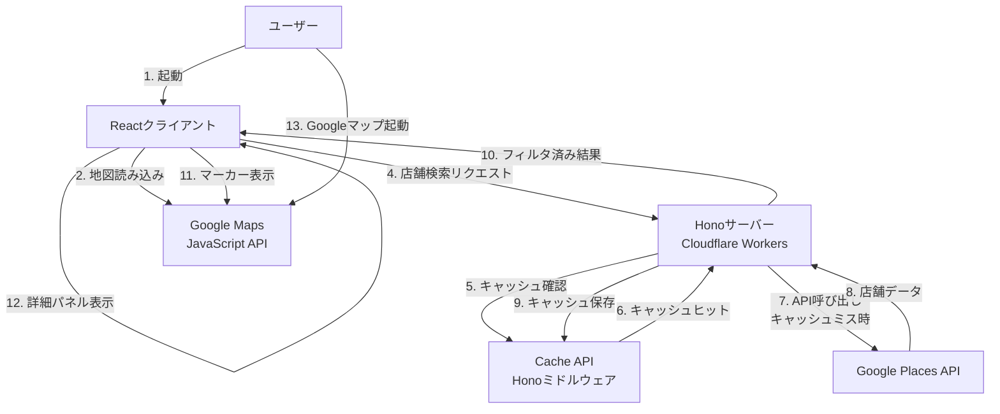

# アーキテクチャと意思決定

## アーキテクチャ

### 既存アーキテクチャ分析

本プロジェクトは既存のモノレポボイラープレート上に構築されます：

- **モノレポ構成**: Bun workspaces + Turboによる依存関係管理
- **クライアント**: React 19.2.0 + Vite 6.4.0 + Tailwind CSS 4.1.14
- **サーバー**: Hono 4.10.1（Cloudflare Workers想定）
- **共通層**: workspace間で共有される型定義（`yonayona-dinner-shared`）
- **既存パターン**: shadcn/uiベースのコンポーネント設計、Biomeによるコード品質管理

### アーキテクチャ概要



### 技術スタック整合性

既存の技術スタックに以下の新規依存関係を追加します：

**フロントエンド追加依存関係(すべて最新版をインストールする)**:
- `@googlemaps/js-api-loader`: （Google Maps API読み込み）
- `@types/google.maps`:（TypeScript型定義）
- `date-fns`: （日時処理・営業時間判定）
- `date-fns-tz`: （タイムゾーン対応）

**バックエンド追加依存関係**:
- 新規依存なし（標準fetchとCloudflare Workers APIを使用）

**Hono Cache Middleware**:
- Web Standards Cache APIを使用（Honoビルトインミドルウェア）
- Cloudflare Workersで自動的にCache APIが利用可能

**技術選定の理由**:
- **Google Maps JavaScript API**: 要件で指定された地図表示・マーカー配置の標準的な選択肢
- **Google Places API (New)**: 営業時間情報を含む店舗検索の最新API
- **date-fns**: 軽量で関数型アプローチの日時ライブラリ、24時跨ぎ判定に最適
- **Hono Cache Middleware**: Web Standards Cache APIを使用、Cloudflare Workers環境でのキャッシング最適化

### レイヤー別実装パターン

本プロジェクトでは、サーバーサイドとクライアントサイドで異なる実装パターンを採用します。

#### サーバーサイド（`server/`）

**クラスベース実装が許可される範囲**（外部通信を行う場合のみ）:

```
server/
├── loaders/          # エントリーポイント（DI実施）
│   └── *.ts         # 具象Repositoryのインスタンス化を行う唯一の場所
├── usecases/         # ビジネスロジック（クラス）
│   └── *.ts         # 複数Repositoryの連携、エラーハンドリング
├── repositories/     # データアクセス層（クラス）
│   ├── interfaces/  # リポジトリインターフェース（type定義）
│   └── *.ts         # Google Places API等への外部API接続
└── utils/            # 純粋関数（関数ベース）
    └── *.ts         # 副作用なし、データ変換のみ
```

**実装パターン**:

```typescript
// server/src/repositories/interfaces/places-repository.interface.ts
export type IPlacesRepository = {
  searchNearby({
    location,
    radius
  }: {
    location: LatLng;
    radius: number;
  }): Promise<Result<Place[], PlacesAPIError>>;
};

// server/src/repositories/google-places.repository.ts
export class GooglePlacesRepository implements IPlacesRepository {
  constructor(private apiKey: string) {}

  async searchNearby({
    location,
    radius
  }: {
    location: LatLng;
    radius: number;
  }): Promise<Result<Place[], PlacesAPIError>> {
    // 実装
  }
}

// server/src/usecases/search-nearby-places.usecase.ts
export class SearchNearbyPlacesUsecase {
  constructor(
    private placesRepository: IPlacesRepository
  ) {}

  async execute(params: SearchParams): Promise<Result<...>> {
    // ビジネスロジック（キャッシングはHonoミドルウェアが自動処理）
  }
}

// server/src/loaders/search-places-loader.ts
export function createSearchPlacesLoader(env: Env) {
  return async (params: SearchParams) => {
    // DIの一元管理
    const placesRepo = new GooglePlacesRepository(env.GOOGLE_PLACES_API_KEY);
    const usecase = new SearchNearbyPlacesUsecase(placesRepo);
    return await usecase.execute(params);
  };
}
```

**判断基準**:
- **クラスベース**: 外部通信を行う（Places API、将来のDB接続等）
- **関数ベース**: 純粋関数のみ（utils、データ変換、計算処理等）

#### クライアントサイド（`client/`）

**完全に関数ベース実装**:

```
client/
├── components/       # Reactコンポーネント
│   └── *.tsx        # 関数コンポーネントのみ
├── services/         # API呼び出し（関数ベース）
│   └── *.ts         # 純粋関数として実装
├── hooks/            # カスタムフック
│   └── *.ts         # useXxx形式
└── lib/              # ユーティリティ（関数ベース）
    └── *.ts         # 副作用なし、純粋関数
```

**実装パターン**:

```typescript
// client/src/services/map-service.ts
export async function initializeMap({
  element,
  center
}: {
  element: HTMLElement;
  center: LatLng;
}): Promise<Result<google.maps.Map, MapError>> {
  // 実装
}

export function displayMarkers({
  map,
  places
}: {
  map: google.maps.Map;
  places: Place[];
}): Result<void, MarkerError> {
  // 実装
}

// client/src/services/places-service.ts
export async function searchNearby({
  location,
  radius
}: {
  location: LatLng;
  radius: number;
}): Promise<Result<Place[], PlacesAPIError>> {
  // サーバーへのfetch呼び出し
}

// client/src/lib/opening-hours-filter.ts
export function isOpenAt({
  openingHours,
  targetTime
}: {
  openingHours: OpeningHours | undefined;
  targetTime: Date;
}): boolean {
  // 純粋関数として営業時間判定
}

export function filterOpenPlaces({
  places,
  targetTime
}: {
  places: Place[];
  targetTime: Date;
}): Place[] {
  // 純粋関数としてフィルタリング
}
```

**理由**:
- クライアントサイドは外部APIへの直接通信なし（すべてサーバー経由）
- 状態管理はReact Hooksで十分
- DIパターンの必要性が低い（モック化が必要な外部依存なし）
- 関数型アプローチでシンプルに保つ

#### 共通層（`shared/`）

**型定義のみ（関数ベース）**:

```typescript
// shared/src/types/index.ts
export type Place = {
  id: string;
  displayName: string;
  location: LatLng;
  formattedAddress: string;
  currentOpeningHours?: OpeningHours;
};

export type Result<T, E> =
  | { success: true; data: T }
  | { success: false; error: E };
```

### 主要な技術的意思決定

#### 決定1: サーバーサイドプロキシパターンによるAPI統合

**決定**: Google Places APIへのすべてのリクエストをHonoサーバー経由で実行し、クライアントから直接APIを呼び出さない

**背景**: Google Places APIはAPIキー認証を必要とし、クライアントサイドに直接埋め込むとキーが露出するセキュリティリスクがある

**代替案**:
1. **クライアント直接呼び出し + HTTPリファラー制限**: シンプルだがAPIキーが露出し、リファラー偽装のリスクがある
2. **Firebase Extensionsの使用**: サーバーレス統合は容易だが、Cloudflare Workers環境との統合コストが高い
3. **サーバーサイドプロキシ（選択）**: Cloudflare Workers Secretsでキーを保護し、キャッシング層も統合可能

**選択したアプローチ**:

```typescript
// server/src/places-proxy.ts
export async function searchNearby({
  location,
  radius,
  env
}: {
  location: { lat: number; lng: number };
  radius: number;
  env: Env;
}): Promise<PlacesSearchResponse> {
  const apiKey = env.GOOGLE_PLACES_API_KEY; // Workers Secret

  const response = await fetch(
    'https://places.googleapis.com/v1/places:searchNearby',
    {
      method: 'POST',
      headers: {
        'Content-Type': 'application/json',
        'X-Goog-Api-Key': apiKey,
        'X-Goog-FieldMask': 'places.displayName,places.location,places.currentOpeningHours,places.formattedAddress'
      },
      body: JSON.stringify({
        includedTypes: ['restaurant', 'cafe', 'bar'],
        maxResultCount: 20,
        locationRestriction: {
          circle: { center: location, radius }
        }
      })
    }
  );

  return response.json();
}
```

**根拠**:
- **セキュリティ**: APIキーがクライアントに露出しない
- **コスト最適化**: サーバーサイドでField Maskを制御し、必要最小限のフィールドのみ取得
- **キャッシング**: Honoキャッシュミドルウェアでレスポンスをキャッシュし、API呼び出しを削減

**トレードオフ**:
- **利点**: セキュリティ強化、コスト最適化、キャッシング統合
- **欠点**: サーバーへの追加リクエストによるレイテンシ増加（~50ms）、Workers実行コスト

#### 決定2: クライアントサイド営業時間フィルタリング

**決定**: Places APIから取得した店舗データをサーバーで返却後、クライアント側で営業時間フィルタリングを実行

**背景**: Places API Nearby Searchには営業中フィルタがなく、すべての店舗を取得してからフィルタリングする必要がある

**代替案**:
1. **サーバーサイドフィルタリング**: サーバーで営業時間判定を実行し、フィルタ済みデータのみ返却
2. **クライアントサイドフィルタリング（選択）**: クライアントで営業時間判定とフィルタリングを実行
3. **Places API Text Searchの活用**: クエリで営業中を指定するが、精度が低く信頼性に欠ける

**選択したアプローチ**:

**根拠**:
- **リアルタイム性**: ユーザーが時間調整UIを操作した際に即座にフィルタリング結果を反映
- **サーバー負荷削減**: フィルタリング処理をクライアントに分散
- **キャッシュ効率**: 時間帯に依存しない生データをキャッシュし、再利用性を向上

**トレードオフ**:
- **利点**: 時間調整UIでの即座な反映、サーバー負荷削減、キャッシュ効率
- **欠点**: クライアントサイドでの追加処理、営業時間データの肥大化時のパフォーマンス懸念

#### 決定3: Google Maps JavaScript APIの直接統合

**決定**: クライアント側でGoogle Maps JavaScript APIを直接読み込み、地図表示とマーカー配置を実行

**背景**: 地図のインタラクティブな操作（ズーム、パン、マーカークリック）はクライアントサイドで実行する必要がある

**根拠**:
- **要件適合**: 地図表示とマーカー配置の要件を満たす標準的な選択肢
- **パフォーマンス**: Google CDNによる高速配信、グローバルキャッシング
- **統合容易性**: Places APIとの統合が容易で、型定義も充実

**トレードオフ**:
- **利点**: 標準的で信頼性が高い、Places APIとシームレス統合、豊富なドキュメント
- **欠点**: Google依存、APIキー管理の必要性、月間クレジット超過時の課金

#### 決定4: 依存性注入パターン（サーバーサイドのみ）

**決定**: サーバーサイドの外部通信層（Usecase、Repository）にクラスベースの依存性注入パターンを採用し、クライアントサイドは完全に関数ベースで実装

**背景**:
- Google Places APIへの外部依存がテストを困難にする
- モックリポジトリを注入することでユニットテストが可能になる
- Next.jsプロジェクトでの実績（参考: docs/server/2025-10-19_DI参考例.md）
- クライアントサイドは外部APIへの直接通信がなく、DIの必要性が低い
- キャッシングはHonoミドルウェアが自動処理するため、CacheRepositoryは不要

**アーキテクチャ**:

```
Loader（エントリーポイント）
  ↓ 具象Repositoryをインスタンス化
Usecase（ビジネスロジック）
  ↓ インターフェースに依存
IPlacesRepository（抽象）
  ↑ 実装
GooglePlacesRepository（具象）
```

**サーバーサイド実装例（クラスベース）**:

```typescript
// 1. インターフェース定義
type IPlacesRepository = {
  searchNearby({
    location,
    radius
  }: {
    location: LatLng;
    radius: number;
  }): Promise<Result<Place[], PlacesAPIError>>;
};

// 2. 具象クラス
class GooglePlacesRepository implements IPlacesRepository {
  constructor(private apiKey: string) {}

  async searchNearby({
    location,
    radius
  }: {
    location: LatLng;
    radius: number;
  }): Promise<Result<Place[], PlacesAPIError>> {
    // Google Places API呼び出し
    const response = await fetch(/* ... */);
    return { success: true, data: await response.json() };
  }
}

// 3. Usecase（ビジネスロジック）
class SearchNearbyPlacesUsecase {
  constructor(
    private placesRepository: IPlacesRepository
  ) {}

  async execute({
    location,
    radius,
    targetTime
  }: {
    location: LatLng;
    radius: number;
    targetTime: Date;
  }): Promise<Result<Place[], UsecaseError>> {
    // Places API呼び出し（キャッシングはHonoミドルウェアが自動処理）
    const result = await this.placesRepository.searchNearby({ location, radius });
    if (!result.success) return result;

    return result;
  }
}

// 4. Loader（DIの一元管理）
export function createSearchPlacesLoader(env: Env) {
  return async ({
    location,
    radius,
    targetTime
  }: {
    location: LatLng;
    radius: number;
    targetTime: Date;
  }) => {
    // 具象Repositoryのインスタンス化（Loaderのみが実施）
    const placesRepo = new GooglePlacesRepository(env.GOOGLE_PLACES_API_KEY);

    // Usecaseへの注入
    const usecase = new SearchNearbyPlacesUsecase(placesRepo);

    // 実行
    return await usecase.execute({ location, radius, targetTime });
  };
}

// 5. Honoルーター（キャッシュミドルウェア適用）
import { cache } from 'hono/cache';

app.post(
  '/api/places/search',
  cache({
    cacheName: 'yonayona-dinner-places',
    cacheControl: 'max-age=300', // 5分間キャッシュ
    keyGenerator: async (c) => {
      const body = await c.req.json();
      const lat = body.location.lat.toFixed(3);
      const lng = body.location.lng.toFixed(3);
      return `places:${lat}:${lng}:${body.radius}`;
    }
  }),
  async (c) => {
    const loader = createSearchPlacesLoader(c.env);
    const body = await c.req.json();
    const result = await loader(body);

    if (!result.success) {
      return c.json({ error: result.error }, 500);
    }
    return c.json(result.data);
  }
);
```

**クライアントサイド実装例（関数ベース）**:

```typescript
// client/src/services/map-service.ts
export async function initializeMap({
  element,
  center
}: {
  element: HTMLElement;
  center: LatLng;
}): Promise<Result<google.maps.Map, MapError>> {
  try {
    const { Map } = await google.maps.importLibrary("maps");
    const map = new Map(element, {
      center,
      zoom: 15,
      mapId: 'YONAYONA_DINNER_MAP'
    });
    return { success: true, data: map };
  } catch (error) {
    return {
      success: false,
      error: {
        type: 'INITIALIZATION_FAILED',
        message: error.message
      }
    };
  }
}

export function displayMarkers({
  map,
  places
}: {
  map: google.maps.Map;
  places: Place[];
}): Result<void, MarkerError> {
  try {
    places.forEach(place => {
      new google.maps.Marker({
        position: place.location,
        map,
        icon: {
          path: google.maps.SymbolPath.CIRCLE,
          fillColor: '#FFD700', // 黄金色
          fillOpacity: 1,
          strokeWeight: 2,
          strokeColor: '#FFFFFF',
          scale: 8
        }
      });
    });
    return { success: true, data: undefined };
  } catch (error) {
    return {
      success: false,
      error: {
        type: 'MARKER_CREATION_FAILED',
        message: error.message
      }
    };
  }
}

// client/src/services/places-service.ts
export async function searchNearby({
  location,
  radius
}: {
  location: LatLng;
  radius: number;
}): Promise<Result<Place[], PlacesAPIError>> {
  try {
    const response = await fetch('/api/places/search', {
      method: 'POST',
      headers: { 'Content-Type': 'application/json' },
      body: JSON.stringify({ location, radius })
    });

    if (!response.ok) {
      return {
        success: false,
        error: {
          type: 'NETWORK_ERROR',
          message: `HTTP ${response.status}`
        }
      };
    }

    const data = await response.json();
    return { success: true, data };
  } catch (error) {
    return {
      success: false,
      error: {
        type: 'NETWORK_ERROR',
        message: error.message
      }
    };
  }
}
```

**トレードオフ**:
- **利点**:
  - サーバーサイドのテスタビリティ向上（モックによるユニットテスト）
  - 疎結合なアーキテクチャ（外部APIの差し替え容易）
  - ビジネスロジックの再利用性（Loader、Action、API Routeから共通利用）
- **欠点**:
  - サーバーサイドのみクラスベース（学習コスト増加）
  - Loaderでのインスタンス化コード（ボイラープレート増加）
- **判断基準**:
  - 外部通信を行う場合のみDI適用（Places API）
  - それ以外は関数ベース（クライアントサイド全体、サーバーのutils等）
