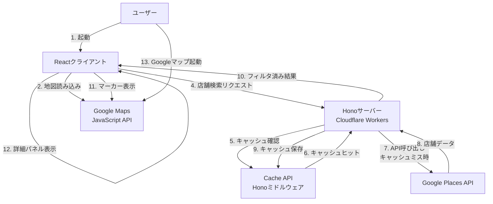

# アーキテクチャと意思決定

## アーキテクチャ

### 既存アーキテクチャ分析

本プロジェクトは既存のモノレポボイラープレート上に構築されます：

- **モノレポ構成**: Bun workspaces + Turboによる依存関係管理
- **クライアント**: React 19.2.0 + Vite 6.4.0 + Tailwind CSS 4.1.14
- **サーバー**: Hono 4.10.1（Cloudflare Workers想定）
- **共通層**: workspace間で共有される型定義（`yonayona-dinner-shared`）
- **既存パターン**: shadcn/uiベースのコンポーネント設計、Biomeによるコード品質管理

### アーキテクチャ概要



### 技術スタック整合性

既存の技術スタックに以下の新規依存関係を追加します：

**フロントエンド追加依存関係(すべて最新版をインストールする)**:
- `@googlemaps/js-api-loader`: （Google Maps API読み込み）
- `@types/google.maps`:（TypeScript型定義）

**バックエンド追加依存関係**:
- `date-fns`: （日時処理・営業時間判定）

**共通依存関係**:
- 新規依存なし（標準fetchとCloudflare Workers APIを使用）

**Hono Cache Middleware**:
- Web Standards Cache APIを使用（Honoビルトインミドルウェア）
- Cloudflare Workersで自動的にCache APIが利用可能

**技術選定の理由**:
- **Google Maps JavaScript API**: 要件で指定された地図表示・マーカー配置の標準的な選択肢
- **Google Places API (New)**: 営業時間情報を含む店舗検索の最新API
- **date-fns (バックエンド)**: 軽量で関数型アプローチの日時ライブラリ、24時跨ぎ判定に最適、サーバー側で営業時間判定を実行
- **Hono Cache Middleware**: Web Standards Cache APIを使用、Cloudflare Workers環境でのキャッシング最適化

### レイヤー別実装パターン

本プロジェクトでは、サーバーサイドとクライアントサイドで異なる実装パターンを採用します。

#### サーバーサイド（`server/`）

**クラスベース実装が許可される範囲**（外部通信を行う場合のみ）:

```
server/
├── loaders/          # エントリーポイント（DI実施）
│   └── *.ts         # 具象Repositoryのインスタンス化を行う唯一の場所
├── usecases/         # ビジネスロジック（クラス）
│   └── *.ts         # 複数Repositoryの連携、エラーハンドリング
├── repositories/     # データアクセス層（クラス）
│   ├── interfaces/  # リポジトリインターフェース（type定義）
│   └── *.ts         # Google Places API等への外部API接続
├── domain/           # ドメイン層（関数ベース）
│   └── places/      # 店舗関連ドメインロジック(ドメインが増えればフォルダを追加する)
│       ├── place.ts         # Placeエンティティ、ドメインルール
│       ├── places-mapper.ts # 外部API → ドメインモデル変換
│       └── opening-hours-service.ts # 営業時間Domain Service
└── utils/            # 純粋関数（関数ベース）
    └── *.ts         # 副作用なし、データ変換のみ
```

**実装パターン**:

```typescript
// server/src/repositories/interfaces/places-repository.interface.ts
export type IPlacesRepository = {
  searchNearby({
    location,
    radius
  }: {
    location: LatLng;
    radius: number;
  }): Promise<Result<Place[], PlacesAPIError>>;
};

// server/src/repositories/google-places.repository.ts
export class GooglePlacesRepository implements IPlacesRepository {
  constructor(private apiKey: string) {}

  async searchNearby({
    location,
    radius
  }: {
    location: LatLng;
    radius: number;
  }): Promise<Result<Place[], PlacesAPIError>> {
    // 実装
  }
}

// server/src/usecases/search-nearby-places.usecase.ts
export class SearchNearbyPlacesUsecase {
  constructor(
    private placesRepository: IPlacesRepository
  ) {}

  async execute(params: SearchParams): Promise<Result<...>> {
    // ビジネスロジック（キャッシングはHonoミドルウェアが自動処理）
  }
}

// server/src/loaders/search-places-loader.ts
export function createSearchPlacesLoader(env: Env) {
  return async (params: SearchParams) => {
    // DIの一元管理
    const placesRepo = new GooglePlacesRepository(env.GOOGLE_PLACES_API_KEY);
    const usecase = new SearchNearbyPlacesUsecase(placesRepo);
    return await usecase.execute(params);
  };
}
```

**判断基準**:
- **クラスベース**: usecaseやrepositoryなど外部通信を行う箇所のみ（Places API、将来のDB接続等）
- **関数ベース**: 純粋関数のみ（utils、データ変換、計算処理等）

#### クライアントサイド（`client/`）

**完全に関数ベース実装**:

```
client/
├── components/       # Reactコンポーネント
│   └── *.tsx        # 関数コンポーネントのみ
├── services/         # API呼び出し（関数ベース）
│   └── *.ts         # 純粋関数として実装
├── hooks/            # カスタムフック
│   └── *.ts         # useXxx形式
└── lib/              # ユーティリティ（関数ベース）
    └── *.ts         # 副作用なし、純粋関数
```

**実装パターン**:

```typescript
// client/src/services/map-service.ts
export async function initializeMap({
  element,
  center
}: {
  element: HTMLElement;
  center: LatLng;
}): Promise<Result<google.maps.Map, MapError>> {
  // 実装
}

export function displayMarkers({
  map,
  places
}: {
  map: google.maps.Map;
  places: Place[];
}): Result<void, MarkerError> {
  // 実装
}

// client/src/services/places-service.ts
import { hc } from 'hono/client';
import type { AppType } from '@server';

const client = hc<AppType>('/');

export async function searchNearby({
  location,
  radius,
  targetTime
}: {
  location: LatLng;
  radius: number;
  targetTime: string;
}): Promise<Result<FilteredPlace[], PlacesAPIError>> {
  // Hono RPCによる型安全なAPI呼び出し
  const res = await client.api.places.search.$post({
    json: { location, radius, targetTime }
  });

  if (res.ok) {
    const data = await res.json(); // 型推論: { places: FilteredPlace[] }
    return { success: true, data: data.places };
  }

  return { success: false, error: await res.json() };
}

// server/src/domain/places/opening-hours-service.ts
// サーバーサイドのみで営業時間判定・フィルタリング・残り時間計算を実行
export function isOpenAt({
  openingHours,
  targetTime
}: {
  openingHours: OpeningHours | undefined;
  targetTime: Date;
}): boolean {
  // 純粋関数として営業時間判定
}

export function filterOpenPlaces({
  places,
  targetTime
}: {
  places: Place[];
  targetTime: Date;
}): Place[] {
  // 純粋関数としてフィルタリング
}

export function calculateRemainingMinutes({
  openingHours,
  currentTime
}: {
  openingHours: OpeningHours;
  currentTime: Date;
}): number | null {
  // 閉店までの残り時間計算
}
```

**理由**:
- クライアントサイドは外部APIへの直接通信なし（すべてサーバー経由）
- 営業時間判定・残り時間計算はサーバー側で完結
- 状態管理はReact Hooksで十分
- DIパターンの必要性が低い（モック化が必要な外部依存なし）
- 関数型アプローチでシンプルに保つ

#### 共通層（`shared/`）

**型定義のみ（関数ベース）**:

```typescript
// shared/src/types/index.ts
export type Place = {
  id: string;
  displayName: string;
  location: LatLng;
  formattedAddress: string;
  currentOpeningHours?: OpeningHours;
};

export type Result<T, E> =
  | { success: true; data: T }
  | { success: false; error: E };
```

### 主要な技術的意思決定

#### 決定0: Hono RPCによる型安全なクライアント-サーバー通信

**決定**: クライアント側のAPI呼び出しにHono RPC(`hc`)を使用し、サーバー側のAPIスキーマから型を自動推論

**背景**: クライアント側でfetchベースのAPI呼び出しを実装すると、リクエスト/レスポンスの型安全性が失われ、ランタイムエラーのリスクが増加する

**代替案**:
1. **標準fetch + 手動型定義**: シンプルだが型安全性が低く、API変更時の追従が困難
2. **OpenAPI Generator**: 型生成は自動だが、追加のビルドステップが必要で複雑化
3. **Hono RPC（選択）**: サーバー側のAPIスキーマから自動型推論、ゼロビルドステップ

**実装パターン**:

```typescript
// server/src/index.ts
import { Hono } from 'hono';
import { zValidator } from '@hono/zod-validator';
import { z } from 'zod';

const app = new Hono()
  .post('/api/places/search',
    zValidator('json', z.object({
      location: z.object({ lat: z.number(), lng: z.number() }),
      radius: z.number(),
      targetTime: z.string()
    })),
    async (c) => {
      const { location, radius, targetTime } = c.req.valid('json');
      // ビジネスロジック
      return c.json({ places: filteredPlaces }, 200);
    }
  );

export type AppType = typeof app;

// client/src/services/places-service.ts
import { hc } from 'hono/client';
import type { AppType } from '@server';

const client = hc<AppType>('/');

export async function searchNearby({ location, radius, targetTime }: SearchNearbyRequest) {
  // Hono RPCによる型安全なAPI呼び出し
  const res = await client.api.places.search.$post({
    json: { location, radius, targetTime }
  });

  if (!res.ok) {
    return { success: false, error: await res.json() };
  }

  const data = await res.json(); 
  return { success: true, data: data.places };
}
```

**根拠**:
- **型安全性**: サーバー側のAPIスキーマをクライアント側で自動推論、型不整合を防止
- **開発体験**: IDEによる自動補完とエラー検出、リファクタリングが容易
- **ステータスコード別型推論**: 200/404等でレスポンス型が自動的に変化
- **モノレポ親和性**: Bun workspaces + Turboとシームレスに統合

**トレードオフ**:
- **利点**: 型安全性の向上、リファクタリング容易性、ランタイムエラーの削減
- **欠点**: Honoへの依存、TypeScript `strict: true` 必須、型推論の学習コスト

#### 決定1: サーバーサイドプロキシパターンによるAPI統合（Places API）

**決定**: Google Places APIへのすべてのリクエストをHonoサーバー経由で実行し、クライアントから直接APIを呼び出さない

**背景**: Google Places APIはAPIキー認証を必要とし、サーバー側でAPIキーを保護する必要がある

**代替案**:
1. **クライアント直接呼び出し + HTTPリファラー制限**: シンプルだがAPIキーが露出し、リファラー偽装のリスクがある
2. **Firebase Extensionsの使用**: サーバーレス統合は容易だが、Cloudflare Workers環境との統合コストが高い
3. **サーバーサイドプロキシ（選択）**: Cloudflare Workers Secretsでキーを保護し、キャッシング層も統合可能

**根拠**:
- **セキュリティ**: APIキーがクライアントに露出しない
- **コスト最適化**: サーバーサイドでField Maskを制御し、必要最小限のフィールドのみ取得
- **キャッシング**: Honoキャッシュミドルウェアでレスポンスをキャッシュし、API呼び出しを削減

**トレードオフ**:
- **利点**: セキュリティ強化、コスト最適化、キャッシング統合
- **欠点**: サーバーへの追加リクエストによるレイテンシ増加（~50ms）、Workers実行コスト

#### 決定2: サーバーサイド営業時間フィルタリング

**決定**: Places APIから取得した店舗データをサーバー側のDomain Service（`opening-hours-service.ts`）で営業時間フィルタリングを実行し、営業中店舗のみクライアントに返却

**背景**: Places API Nearby Searchには営業中フィルタがなく、すべての店舗を取得してからフィルタリングする必要がある。ビジネスロジックはバックエンドに集約すべき

**代替案**:
1. **サーバーサイドフィルタリング（選択）**: サーバーのDomain Serviceで営業時間判定を実行し、フィルタ済みデータのみ返却
2. **クライアントサイドフィルタリング**: クライアントで営業時間判定とフィルタリングを実行
3. **Places API Text Searchの活用**: クエリで営業中を指定するが、精度が低く信頼性に欠ける

**選択したアプローチ**:

サーバーサイドでの営業時間フィルタリング実装:
- **Domain Service**: `server/src/domain/places/opening-hours-service.ts`に営業時間判定ロジックを配置
- **Usecase連携**: `SearchNearbyPlacesUsecase`からDomain Serviceを呼び出し
- **レスポンス**: 営業中店舗のみ + 閉店までの残り時間を計算済みで返却

**根拠**:
- **ビジネスロジック集約**: 営業時間判定はドメインルール、Domain Serviceとしてバックエンドに配置
- **フロントエンドJS削減**: date-fns依存とフィルタリングロジックをクライアントから削除
- **データ転送量削減**: 営業中店舗のみ返却、不要なデータ送信を回避
- **キャッシュ最適化**: targetTimeを含むキャッシュキーで時間帯別にキャッシング(5分単位)

**トレードオフ**:
- **利点**: ビジネスロジックのバックエンド集約、フロントエンドのJavaScript削減、データ転送量削減、テスタビリティ向上
- **欠点**: 時間調整UI操作時に毎回API呼び出しが必要（キャッシュヒット時は高速）、サーバー側の処理負荷増加

#### 決定3: Google Maps JavaScript APIの直接統合

**決定**: クライアント側でGoogle Maps JavaScript APIを直接読み込み、地図表示とマーカー配置を実行

**背景**: 地図のインタラクティブな操作（ズーム、パン、マーカークリック）はクライアントサイドで実行する必要がある

**根拠**:
- **要件適合**: 地図表示とマーカー配置の要件を満たす標準的な選択肢
- **パフォーマンス**: Google CDNによる高速配信、グローバルキャッシング
- **統合容易性**: Places APIとの統合が容易で、型定義も充実

**トレードオフ**:
- **利点**: 標準的で信頼性が高い、Places APIとシームレス統合、豊富なドキュメント
- **欠点**: Google依存、APIキー管理の必要性、月間クレジット超過時の課金

#### 決定4: 依存性注入パターン（サーバーサイドのみ）

**決定**: サーバーサイドの外部通信層（Usecase、Repository）にクラスベースの依存性注入パターンを採用し、クライアントサイドは完全に関数ベースで実装

**背景**:
- Google Places APIへの外部依存がテストを困難にする
- モックリポジトリを注入することでユニットテストが可能になる
- Next.jsプロジェクトでの実績（参考: docs/server/2025-10-19_DI参考例.md）
- クライアントサイドは外部APIへの直接通信がなく、DIの必要性が低い
- キャッシングはHonoミドルウェアが自動処理するため、CacheRepositoryは不要

**アーキテクチャ**:

```
Loader（エントリーポイント）
  ↓ 具象Repositoryをインスタンス化
Usecase（ビジネスロジック）
  ↓ インターフェースに依存
IPlacesRepository（抽象）
  ↑ 実装
GooglePlacesRepository（具象）
```