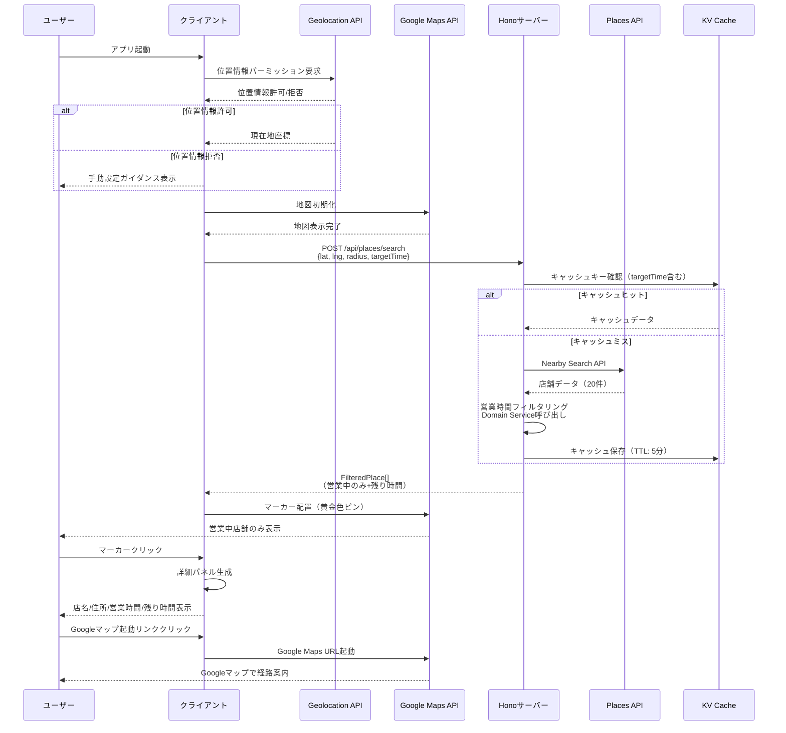
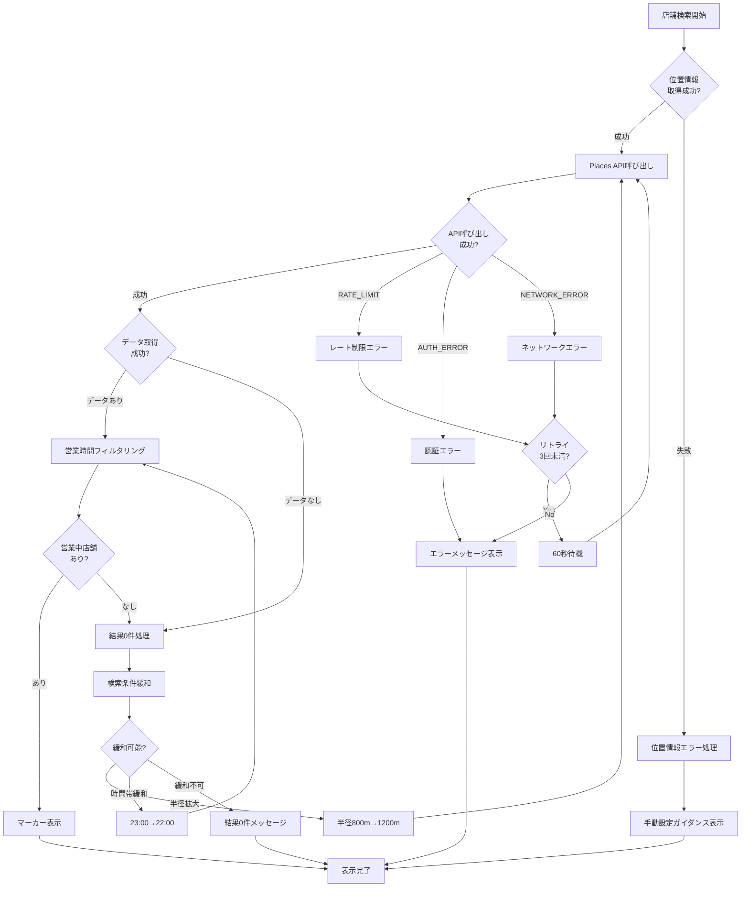

# システムフロー

## システムフロー

### ユーザーフロー: 店舗検索と詳細表示

```mermaid
sequenceDiagram
    participant U as ユーザー
    participant C as クライアント
    participant G as Geolocation API
    participant M as Google Maps API
    participant S as Honoサーバー
    participant P as Places API
    participant K as KV Cache

    U->>C: アプリ起動
    C->>G: 位置情報パーミッション要求
    G-->>C: 位置情報許可/拒否

    alt 位置情報許可
        G-->>C: 現在地座標
    else 位置情報拒否
        C-->>U: 手動設定ガイダンス表示
    end

    C->>M: 地図初期化
    M-->>C: 地図表示完了

    C->>S: POST /api/places/search<br/>{lat, lng, radius, targetTime}
    S->>K: キャッシュキー確認（targetTime含む）

    alt キャッシュヒット
        K-->>S: キャッシュデータ
    else キャッシュミス
        S->>P: Nearby Search API
        P-->>S: 店舗データ（20件）
        S->>S: 営業時間フィルタリング<br/>Domain Service呼び出し
        S->>K: キャッシュ保存（TTL: 5分）
    end

    S-->>C: FilteredPlace[]<br/>（営業中のみ+残り時間）
    C->>M: マーカー配置（黄金色ピン）
    M-->>U: 営業中店舗のみ表示

    U->>C: マーカークリック
    C->>C: 詳細パネル生成
    C-->>U: 店名/住所/営業時間/残り時間表示

    U->>C: Googleマップ起動リンククリック
    C->>M: Google Maps URL起動
    M-->>U: Googleマップで経路案内
```

### エラーフローチャート: API失敗時の挙動

```mermaid
flowchart TD
    Start[店舗検索開始] --> GeoCheck{位置情報<br/>取得成功?}

    GeoCheck -->|成功| APICall[Places API呼び出し]
    GeoCheck -->|失敗| GeoError[位置情報エラー処理]
    GeoError --> ManualGuide[手動設定ガイダンス表示]

    APICall --> APICheck{API呼び出し<br/>成功?}

    APICheck -->|成功| DataCheck{データ取得<br/>成功?}
    APICheck -->|RATE_LIMIT| RateLimit[レート制限エラー]
    APICheck -->|AUTH_ERROR| AuthError[認証エラー]
    APICheck -->|NETWORK_ERROR| NetworkError[ネットワークエラー]

    RateLimit --> Retry{リトライ<br/>3回未満?}
    Retry -->|Yes| Wait[60秒待機]
    Wait --> APICall
    Retry -->|No| ShowError[エラーメッセージ表示]

    AuthError --> ShowError
    NetworkError --> Retry

    DataCheck -->|データあり| Filter[営業時間フィルタリング]
    DataCheck -->|データなし| NoData[結果0件処理]

    Filter --> FilterCheck{営業中店舗<br/>あり?}
    FilterCheck -->|あり| Display[マーカー表示]
    FilterCheck -->|なし| NoData

    NoData --> Relax[検索条件緩和]
    Relax --> RelaxCheck{緩和可能?}
    RelaxCheck -->|半径拡大| ExpandRadius[半径800m→1200m]
    RelaxCheck -->|時間帯緩和| RelaxTime[23:00→22:00]
    RelaxCheck -->|緩和不可| ShowEmpty[結果0件メッセージ]

    ExpandRadius --> APICall
    RelaxTime --> Filter

    Display --> End[表示完了]
    ShowError --> End
    ShowEmpty --> End
    ManualGuide --> End
```
