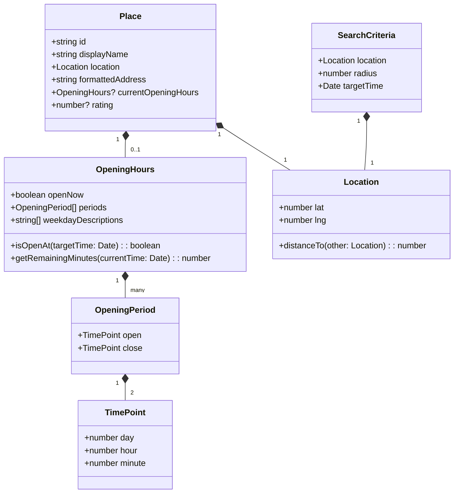

# 共通層とデータモデル

## データモデル

### ドメインモデル

本システムは複雑なドメインロジックを持たないため、簡潔なデータモデルを採用します。

**コアコンセプト**:

- **Place（店舗）**: 値オブジェクト、営業時間情報を含む飲食店の基本情報
- **FilteredPlace（フィルタ済み店舗）**: 値オブジェクト、Place + 残り時間情報
- **OpeningHours（営業時間）**: 値オブジェクト、営業時間帯のリストと営業中フラグ
- **Location（位置情報）**: 値オブジェクト、緯度・経度の座標
- **SearchCriteria（検索条件）**: 値オブジェクト、位置情報・半径・時間帯を含む検索パラメータ

**ドメインイベント**:

- `LocationObtained`: 位置情報が取得された
- `PlacesSearched`: 店舗検索が実行された
- `TimeFilterChanged`: 時間帯フィルタが変更された
- `PlaceSelected`: 店舗が選択された



**ビジネスルールと不変条件**:

1. **営業時間の整合性**: `periods`配列は空でない、各`period`は`open`と`close`を持つ
2. **座標の有効性**: 緯度は-90~90、経度は-180~180の範囲内
3. **半径の妥当性**: 半径は1~50000メートルの範囲内
4. **営業中判定**: `currentOpeningHours.periods`を基に、24時跨ぎを考慮した判定を実行
5. **タイムゾーン戦略**: すべての時刻計算は**日本標準時（JST, UTC+9）**で実行される
   - Google Places APIの営業時間情報は日本国内店舗の現地時刻（JST）
   - クライアントから送信される`targetTime`はJSTとして解釈される
   - サーバー側の時刻計算は`date-fns-tz`を使用してJST固定で実行
   - エッジランタイム（Cloudflare Workers）でもタイムゾーンを明示的に扱う

### 論理データモデル

**エンティティ関係**:

- **Place** (1) - (0..1) **OpeningHours**: 店舗は営業時間情報を持つ（任意）
- **OpeningHours** (1) - (many) **OpeningPeriod**: 営業時間は複数の営業時間帯を持つ
- **Place** (1) - (1) **Location**: 店舗は1つの位置情報を持つ

**属性と型定義**:

```typescript
// Place Entity
type Place = {
  id: string;                    // 一意識別子（Google Place ID）
  displayName: string;           // 表示名
  location: Location;            // 位置情報
  formattedAddress: string;      // 住所
  currentOpeningHours?: OpeningHours; // 営業時間（任意）
  rating?: number;               // 評価（0.0-5.0、任意）
};

// OpeningHours Value Object
type OpeningHours = {
  openNow: boolean;              // 現在営業中フラグ
  periods: OpeningPeriod[];      // 営業時間帯リスト
  weekdayDescriptions: string[]; // 曜日別営業時間説明
};

// OpeningPeriod Value Object
type OpeningPeriod = {
  open: TimePoint;               // 開店時刻
  close: TimePoint;              // 閉店時刻
};

// TimePoint Value Object
type TimePoint = {
  day: number;                   // 曜日（0=日曜, 6=土曜）
  hour: number;                  // 時（0-23）
  minute: number;                // 分（0-59）
};

// Location Value Object
type Location = {
  lat: number;                   // 緯度（-90~90）
  lng: number;                   // 経度（-180~180）
}
```

**整合性と整合性制約**:

- **参照整合性**: `Place.currentOpeningHours`は`OpeningHours`への参照（任意）
- **カーディナリティ**: `OpeningHours.periods`は1つ以上の`OpeningPeriod`を持つ
- **時間的側面**: 営業時間データはAPIから取得時点のスナップショット、5分間キャッシュされる

### データ契約とインテグレーション

#### API データ転送

**リクエストスキーマ**:

```typescript
// クライアント → サーバー
type SearchNearbyRequest = {
  location: {
    lat: number;
    lng: number;
  };
  radius: number;
  targetTime: string; // ISO 8601形式 "yyyy-MM-ddTHH:mm:ss"
};
```

**レスポンススキーマ**:

```typescript
// サーバー → クライアント
type FilteredPlacesResponse = {
  places: FilteredPlace[];
};

type FilteredPlace = Place & {
  remainingMinutes: number; // 閉店までの残り時間（分）
};
```

**バリデーションルール**:

```typescript
// リクエストバリデーション（サーバー側）
function validateSearchRequest({
  req
}: {
  req: SearchNearbyRequest;
}): Result<SearchNearbyRequest, ValidationError> {
  if (req.location.lat < -90 || req.location.lat > 90) {
    return { success: false, error: 'INVALID_LATITUDE' };
  }
  if (req.location.lng < -180 || req.location.lng > 180) {
    return { success: false, error: 'INVALID_LONGITUDE' };
  }
  if (req.radius < 1 || req.radius > 50000) {
    return { success: false, error: 'INVALID_RADIUS' };
  }
  // targetTime形式検証
  const targetDate = new Date(req.targetTime);
  if (isNaN(targetDate.getTime())) {
    return { success: false, error: 'INVALID_TARGET_TIME' };
  }
  return { success: true, data: req };
}
```

**シリアライゼーション形式**: JSON

#### クロスサービスデータ管理

**キャッシュ戦略**:

- **キャッシュキー**: `places:${lat}:${lng}:${radius}` 形式
- **TTL**: 5分（300秒）
- **無効化**: TTL経過後に自動削除、手動無効化なし

**結果整合性の処理**:

- Web Standards Cache APIは強整合性（Cache-Controlヘッダーに基づく明確なTTL管理）
- キャッシュが古い場合、最大5分間のズレが生じる可能性がある（TTL範囲内）
- ユーザーは時間調整UIで手動リフレッシュ可能（再検索により新しいデータを取得）
